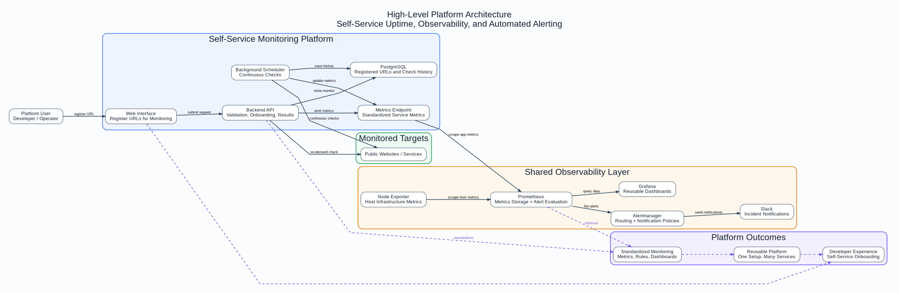
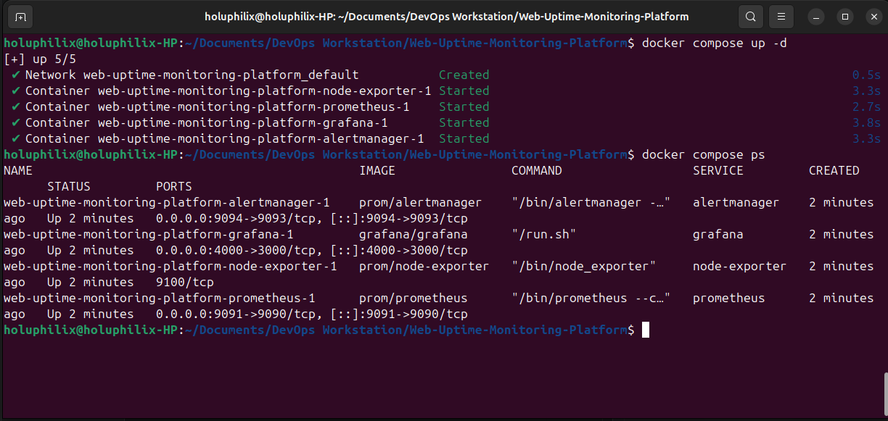
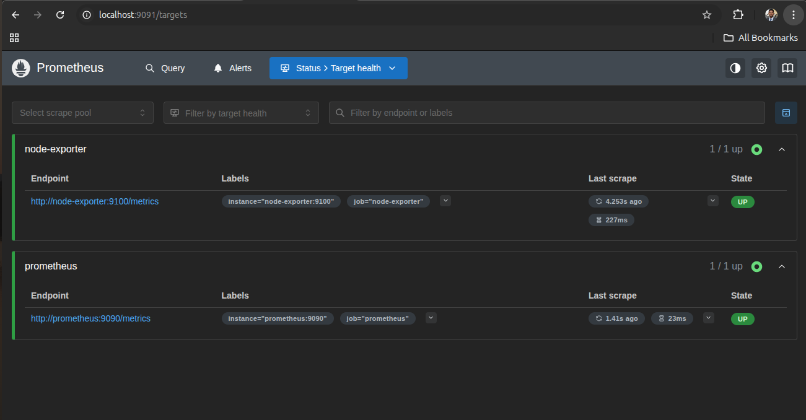
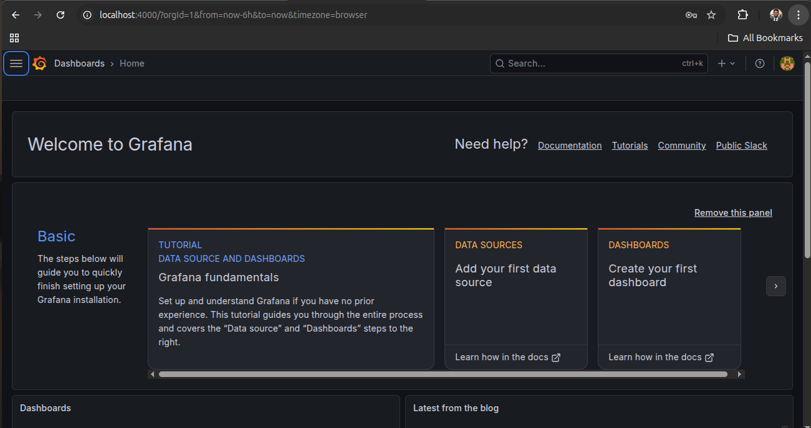
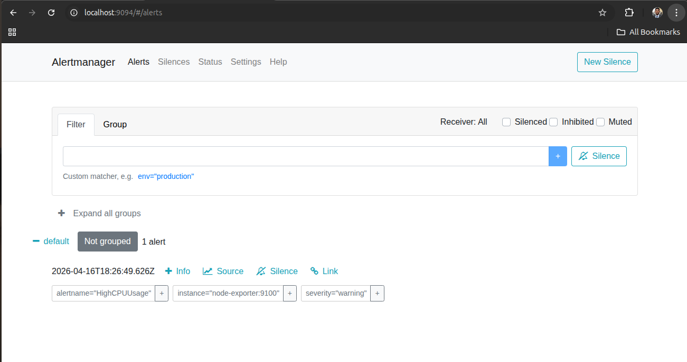

# 🚀 Web-Based Uptime & Performance Monitoring Platform (Platform Engineering Approach)

## 📖 Project Overview

This project is a **Platform-Driven Uptime & Performance Monitoring System** designed to simulate how modern organizations build internal developer platforms for monitoring and observability.

Instead of manually configuring monitoring for each service, this platform provides a **self-service solution** where users can register any public website URL and automatically receive:

* Continuous uptime checks
* Performance metrics
* Real-time dashboards
* Automated alerting

The system demonstrates the evolution from **traditional DevOps to Platform Engineering**, focusing on **automation, reusability, and developer enablement**.

## 🏗️ Architecture Diagram

The diagram below illustrates the high-level system architecture, including the monitoring platform and observability stack.



## 🧠 Architecture Overview

The system is composed of two main layers working together to provide real-time visibility and alerting.

### 🔷 Monitoring Application Layer

This layer handles user interaction, automation, and monitoring logic.

* **Web Interface**

  * Allows users to register URLs for monitoring

* **Backend API (Node.js)**

  * Sends HTTP requests to target websites
  * Measures response time and availability
  * Exposes metrics via `/metrics` for Prometheus

* **Background Scheduler**

  * Executes continuous checks at defined intervals
  * Enables automated monitoring without user interaction

* **PostgreSQL Database**

  * Stores monitored URLs
  * Persists historical check data (status, latency, timestamps)

* **Monitored Targets**

  * External public websites being tested

### 🔶 Observability Stack

This layer provides monitoring, visualization, and alerting capabilities.

* **Prometheus**

  * Scrapes metrics from:

    * application
    * Node Exporter
  * Stores time-series data
  * Evaluates alert rules

* **Grafana**

  * Queries Prometheus
  * Visualizes uptime, latency, and system metrics

* **Alertmanager**

  * Processes alerts from Prometheus
  * Handles routing and notifications

* **Slack**

  * Receives real-time alert notifications

* **Node Exporter**

  * Provides host-level metrics:

    * CPU
    * memory
    * disk
    * network

## 🏗️ Platform Engineering Approach

This project applies **Platform Engineering principles** to move beyond traditional DevOps practices.

### 🔹 Self-Service Monitoring

Users can onboard new URLs without requiring manual DevOps setup.

### 🔹 Automation

Monitoring, alerting, and metric collection happen automatically once a URL is registered.

### 🔹 Standardization

All monitored services follow a consistent:

* Metrics structure
* Alerting rules
* Dashboard format

### 🔹 Reusability

The system is designed to support multiple services without reconfiguration.

### 🔹 Developer Experience (DX)

Developers can:

* Register a service
* Instantly gain monitoring and alerts

## 🔄 System Flow

### 1. Application Flow

1. User submits a URL
2. Backend API performs availability check
3. Results are stored in PostgreSQL
4. Scheduler enables continuous monitoring

### 2. Monitoring & Alerting Flow

1. Application exposes metrics
2. Prometheus scrapes and stores metrics
3. Grafana visualizes system performance
4. Prometheus evaluates alert conditions
5. Alertmanager processes alerts
6. Slack receives notifications

## 🎯 Project Objectives (Platform-Focused)

* Build a self-service monitoring platform
* Eliminate manual monitoring setup
* Standardize observability across services
* Enable automated alerting and visualization
* Demonstrate real-world platform engineering practices

## 🧠 Problem Statement

Modern systems require continuous visibility to ensure reliability and performance.

Key questions include:

* Is the service available?
* How fast is it responding?
* When do failures occur?
* How quickly can issues be detected and addressed?

This project solves these challenges by combining **monitoring, observability, and alerting into a unified platform**.

## ⚙️ Key Features

### Core Features

* URL availability checks (UP/DOWN)
* Response time measurement
* On-demand testing
* Scheduled background monitoring

### Observability Features

* Prometheus-based metrics collection
* Grafana dashboards for visualization
* Alertmanager for alert routing
* Slack notifications for incidents
* Node Exporter for system metrics

### Platform Features

* Self-service onboarding of monitored services
* Automatic monitoring and alert setup
* Unified dashboards across services
* Reusable system architecture

## 🧰 Technology Stack

* **Backend:** Node.js (Express)
* **Database:** PostgreSQL
* **Monitoring:** Prometheus
* **Visualization:** Grafana
* **Alerting:** Alertmanager + Slack
* **System Metrics:** Node Exporter
* **Containerization:** Docker & Docker Compose
* **Architecture Style:** Platform Engineering

## 🚀 Project Scope

### Current Scope (MVP)

* URL testing
* Metrics exposure
* Observability stack setup
* Alerting pipeline
* Infrastructure monitoring

### Future Enhancements

* Multi-user support
* API authentication
* Kubernetes deployment
* AI-based anomaly detection
* Distributed tracing

## 📁 Project Structure

```bash
web-uptime-monitoring-platform/
│
├── app/
│   ├── src/
│   │   ├── controllers/
│   │   ├── services/
│   │   ├── routes/
│   │   ├── metrics/
│   │   ├── scheduler/
│   │   └── db/
│   ├── package.json
│   └── Dockerfile
│
├── database/
│   └── init.sql
│
├── monitoring/
│   ├── prometheus/
│   │   ├── prometheus.yml
│   │   └── alert.rules.yml
│   │
│   ├── alertmanager/
│   │   └── alertmanager.yml
│   │
│   └── grafana/
│       └── provisioning/
│
├── docker-compose.yml
│
├── Images/
│   └── high-level-system-architecture.png
│
└── README.md
```

## 💡 Key Takeaway

This project demonstrates the transition from:

👉 Traditional DevOps
➡️ Platform Engineering

By building:

* Automated systems
* Reusable infrastructure
* Self-service monitoring capabilities

## 🚀 Task 1: Build the Core Observability Platform

### 🎯 Objective

Set up the **standardized observability layer** that powers the monitoring platform.

This layer will provide:

* Metrics collection
* Visualization dashboards
* Alerting pipeline
* Infrastructure monitoring

👉 At this stage, we are building the **foundation of the monitoring platform**, which will later be reused automatically for all onboarded services.

### 🧠 Platform Engineering Context

In a Platform Engineering setup, observability is not configured per service.

Instead:

* Monitoring is **pre-configured once**
* All services automatically inherit:

  * Metrics collection
  * Alerting rules
  * Dashboards

👉 This task establishes that **reusable monitoring backbone**

#### 🧱 Step 1: Initialize Project Structure

From your project root directory, create all required folders and files:

```bash
mkdir -p monitoring/prometheus
mkdir -p monitoring/alertmanager
mkdir -p monitoring/grafana
mkdir -p database
mkdir -p Images

touch docker-compose.yml

# Prometheus files
touch monitoring/prometheus/prometheus.yml
touch monitoring/prometheus/alert.rules.yml

# Alertmanager config
touch monitoring/alertmanager/alertmanager.yml

# (Optional - used later)
touch database/init.sql
```

#### 📄 Step 2: Configure Docker Compose

Edit the `docker-compose.yml` file:

```yaml
services:

  prometheus:
    image: prom/prometheus
    ports:
      - "9091:9090"
    volumes:
      - ./monitoring/prometheus/prometheus.yml:/etc/prometheus/prometheus.yml
      - ./monitoring/prometheus/alert.rules.yml:/etc/prometheus/alert.rules.yml
    command:
      - "--config.file=/etc/prometheus/prometheus.yml"

  grafana:
    image: grafana/grafana
    ports:
      - "4000:3000"
    environment:
      - GF_SECURITY_ADMIN_USER=admin
      - GF_SECURITY_ADMIN_PASSWORD=admin

  alertmanager:
    image: prom/alertmanager
    ports:
      - "9094:9093"
    volumes:
      - ./monitoring/alertmanager/alertmanager.yml:/etc/alertmanager/alertmanager.yml
    command:
      - "--config.file=/etc/alertmanager/alertmanager.yml"

  node-exporter:
    image: prom/node-exporter
```

### ⚠️ Important Notes

* No fixed `container_name` is used → avoids conflicts
* `node-exporter` is internal → prevents port collision on `9100`
* Services communicate via Docker network

👉 This setup reflects **production-safe container practices**

#### 📄 Step 3: Configure Prometheus

Create:

```bash
monitoring/prometheus/prometheus.yml
```

```yaml
global:
  scrape_interval: 5s

rule_files:
  - "alert.rules.yml"

alerting:
  alertmanagers:
    - static_configs:
        - targets:
            - "alertmanager:9093"

scrape_configs:

  - job_name: "prometheus"
    static_configs:
      - targets: ["prometheus:9090"]

  - job_name: "node-exporter"
    static_configs:
      - targets: ["node-exporter:9100"]
```

👉 Prometheus acts as the **central metrics engine** for the platform.

#### 📄 Step 4: Create Alert Rules

Create:

```bash
monitoring/prometheus/alert.rules.yml
```

```yaml
groups:
  - name: system-alerts
    rules:
      - alert: HighCPUUsage
        expr: 100 - (avg by(instance)(rate(node_cpu_seconds_total{mode="idle"}[1m])) * 100) > 80
        for: 1m
        labels:
          severity: warning
        annotations:
          summary: "High CPU usage detected"
```

👉 These rules represent **standardized alerting logic** applied across the platform.

#### 📄 Step 5: Configure Alertmanager

Create:

```bash
monitoring/alertmanager/alertmanager.yml
```

```yaml
global:
  resolve_timeout: 5m

route:
  receiver: "default"

receivers:
  - name: "default"
```

👉 Slack integration will be added in a later task.

### 🚀 Step 6: Start the Observability Stack

Run:

```bash
docker compose up -d
docker compose ps
```

📸 Screenshot:

* Docker containers running
* Save as: 



#### 🧪 Step 7: Verify Services

##### 🔍 Prometheus Targets

👉 http://localhost:9091/targets

Expected:

* `prometheus` → UP
* `node-exporter` → UP

📸 Screenshot:



##### 📊 Grafana

👉 http://localhost:4000

Login:

```text
admin / admin
```

📸 Screenshot:




### 🚨 Alertmanager

👉 http://localhost:9094

📸 Screenshot:



### 🖥️ Node Exporter Metrics

* Verified through Prometheus targets
* Not exposed to host → avoids port conflicts

### 🎯 Success Criteria

Task 1 is complete when:

* Prometheus targets are UP ✅
* Grafana dashboard is accessible ✅
* Alertmanager is running ✅
* Node Exporter metrics are visible ✅

### ⚠️ Common Mistakes to Avoid

* Incorrect YAML indentation ❌
* Wrong volume paths ❌
* Port conflicts ❌
* Using fixed container names ❌

### 💪 Outcome

You have successfully built a **Platform-Level Observability Foundation**, including:

* Centralized metrics collection
* Standardized alerting pipeline
* Visualization layer
* Infrastructure monitoring

👉 This foundation will be automatically reused by all services onboarded into the platform.
