# 🚀 Production-Grade Observability & Uptime Monitoring Platform

## 📖 Project Overview

This project is a **containerized uptime, observability, and alerting platform** designed to simulate how modern engineering teams monitor services in production environments.

The platform allows users to register public website URLs through an API and automatically provides:

* Continuous uptime monitoring
* Response time and latency tracking
* Prometheus-based metrics collection
* Grafana dashboard visualization
* Real-time alerting through Alertmanager and Slack
* Centralized observability for monitored services

Unlike traditional manually configured monitoring setups, this platform follows a **Platform Engineering approach**, where monitoring capabilities are standardized, reusable, and automated through a self-service workflow.

The project demonstrates how modern DevOps and Platform Engineering practices are used to build scalable internal monitoring systems with a strong focus on:

* Automation
* Observability
* Standardization
* Reusability
* Scalability
* Incident response

## 🔍 Core Capabilities

The platform provides:

* Automated uptime monitoring
* Prometheus-based observability
* Grafana visualization dashboards
* Real-time alert routing
* Self-service monitoring onboarding
* Standardized metrics and alerts
* Containerized deployment architecture

## 🧠 Platform Engineering Perspective

In traditional environments, monitoring is often configured manually for each service, leading to inconsistent observability and operational overhead.

This platform addresses that challenge by providing:

* A reusable monitoring workflow
* Standardized metrics and alert structures
* Automated service onboarding
* Centralized observability and alerting
* Production-style container orchestration

👉 The result is a monitoring platform that reflects real-world DevOps and Site Reliability Engineering (SRE) practices.

## 🏗️ Architecture Diagram

The diagram below illustrates the high-level architecture of the monitoring platform, including the application layer, observability stack, and alerting workflow.


## 🧠 Architecture Overview

The platform is composed of two primary layers:

* Monitoring & Service Layer
* Shared Observability Layer

Together, these components provide automated uptime monitoring, metrics collection, visualization, and real-time alerting.

### 🔷 Monitoring & Service Layer

This layer is responsible for service onboarding, monitoring execution, metrics generation, and persistence.

#### **Web Interface**
Provides a self-service interface for registering URLs to be monitored.

#### **Backend API (Node.js)**
Handles monitoring workflows and application logic, including:

* URL registration and validation
* HTTP availability checks
* Response time measurement
* Metrics exposure through `/metrics`
* Persistence of monitoring results

#### **Background Scheduler**
Executes automated monitoring checks at scheduled intervals to ensure continuous service validation.

#### **PostgreSQL**
Stores:

* Registered monitoring targets
* Historical uptime results
* Response time data
* Monitoring timestamps

This enables historical analysis and uptime tracking.

#### **Monitored Targets**
Represents external public websites and services monitored by the platform.

### 🔶 Shared Observability Layer

This layer centralizes metrics collection, visualization, alert evaluation, and notification delivery.

#### **Prometheus**
Responsible for:

* Scraping application metrics
* Collecting infrastructure metrics from Node Exporter
* Storing time-series data
* Evaluating alert rules

#### **Grafana**
Provides real-time dashboards for:

* Uptime visibility
* Response time analysis
* Infrastructure monitoring
* Operational observability

#### **Alertmanager**
Processes and routes alerts generated by Prometheus, including grouping and notification management.

#### **Slack Integration**
Delivers real-time operational alerts and incident notifications.

#### **Node Exporter**
Exposes host-level infrastructure metrics, including:

* CPU utilization
* Memory usage
* Disk activity
* Network statistics

## 🔄 Monitoring Workflow

The platform follows the following monitoring lifecycle:

1. A monitoring target is registered through the API
2. The scheduler executes periodic uptime checks
3. Metrics are exposed through the application metrics endpoint
4. Prometheus scrapes and stores monitoring metrics
5. Alert rules evaluate service health and performance thresholds
6. Alertmanager routes alerts to Slack
7. Grafana visualizes operational metrics and monitoring trends

## 🎯 Architectural Goals

The platform architecture was designed with the following objectives:

* Automated service monitoring
* Centralized observability
* Reusable monitoring workflows
* Standardized metrics and alerting
* Containerized deployment
* Production-style operational visibility

## 🏗️ Platform Engineering Approach

The platform was designed using Platform Engineering principles to provide standardized, reusable, and automated monitoring workflows.

Instead of configuring monitoring independently for each service, the system centralizes observability through a consistent onboarding and monitoring model.

### 🔹 Self-Service Monitoring

Monitoring targets can be registered dynamically through the API without requiring manual infrastructure or observability configuration.

Once a URL is onboarded, the platform automatically begins:

* Availability monitoring
* Response time collection
* Metrics generation
* Alert evaluation

### 🔹 Automated Observability Workflow

The monitoring lifecycle is fully automated:

* Scheduled uptime checks
* Continuous metrics exposure
* Alert evaluation through Prometheus
* Incident routing through Alertmanager
* Real-time Slack notifications

This reduces operational overhead and ensures consistent monitoring behavior across services.

### 🔹 Standardized Monitoring Model

All monitored services follow a unified observability structure, including:

* Consistent metric naming
* Shared alerting policies
* Reusable dashboard patterns
* Centralized monitoring workflows

This improves scalability, maintainability, and operational consistency.

### 🔹 Reusable Platform Design

The platform architecture supports onboarding multiple services without requiring additional monitoring configuration.

The monitoring pipeline remains reusable across:

* Different target URLs
* Multiple environments
* Additional monitored services

### 🔹 Developer Experience (DX)

The platform simplifies service onboarding by allowing developers to immediately gain:

* Uptime monitoring
* Performance visibility
* Metrics collection
* Automated alerting

without directly managing observability tooling.

## 🔄 System Flow

### 1. Monitoring Workflow

1. A monitoring target is registered through the API
2. The backend validates and stores the target
3. Scheduled monitoring checks execute automatically
4. Response status and latency are recorded
5. Monitoring data is persisted in PostgreSQL
6. Metrics are exposed through `/metrics`

### 2. Observability & Alerting Workflow

1. Prometheus scrapes application and infrastructure metrics
2. Metrics are stored as time-series data
3. Alert rules continuously evaluate service health
4. Grafana visualizes operational and performance metrics
5. Alertmanager processes and routes incidents
6. Slack receives real-time operational notifications

## 🎯 Project Objectives

The platform was built to:

* Centralize monitoring and observability
* Standardize metrics and alerting workflows
* Automate uptime and performance monitoring
* Provide reusable monitoring infrastructure
* Simulate production-style observability practices
* Improve operational visibility and incident response

## 🧠 Operational Context

Modern distributed systems require continuous operational visibility to maintain reliability and performance.

Key operational concerns include:

* Service availability
* Latency and response behavior
* Failure detection
* Alert responsiveness
* Infrastructure visibility

This platform addresses these concerns through a unified monitoring and observability architecture combining:

* Monitoring
* Metrics collection
* Visualization
* Alerting
* Incident notification


## ⚙️ Key Features

### Core Monitoring Features

* Continuous uptime monitoring
* Response time measurement
* Automated background checks
* On-demand monitoring execution
* Historical monitoring persistence

### Observability Features

* Prometheus-based metrics collection
* Custom application instrumentation
* Histogram-based latency tracking
* Grafana dashboard visualization
* Real-time alert evaluation
* Slack-based incident notifications
* Infrastructure monitoring through Node Exporter

### Platform Features

* Self-service service onboarding
* Standardized observability workflows
* Automated monitoring lifecycle
* Reusable monitoring architecture
* Containerized deployment model
* Scalable metric and alert design

## 🧰 Technology Stack

| Category | Technology |
|---|---|
| Backend API | Node.js, Express |
| Database | PostgreSQL |
| Monitoring | Prometheus |
| Visualization | Grafana |
| Alerting | Alertmanager, Slack |
| Metrics | Prometheus Client |
| Containerization | Docker, Docker Compose |
| Scheduling | Node-Cron |
| System Metrics | Node Exporter |
| Version Control | Git & GitHub |
| Observability | Prometheus Ecosystem |
| Platform Engineering | Self-Service Monitoring Architecture |

## 🚀 Project Scope

### Current Platform Capabilities

The platform currently supports:

* Automated uptime monitoring
* Response time and latency tracking
* Prometheus metrics exposure through `/metrics`
* Centralized observability with Grafana dashboards
* Real-time alert routing through Alertmanager
* Slack-based operational notifications
* Infrastructure-level monitoring via Node Exporter
* Persistent monitoring history using PostgreSQL
* Containerized multi-service deployment

### Planned Enhancements

Future improvements may include:

* Multi-user onboarding
* Authentication and access control
* Kubernetes-based deployment
* Distributed tracing with OpenTelemetry
* AI-assisted anomaly detection
* Multi-environment monitoring support
* Advanced dashboard provisioning

## 📁 Project Structure

The repository is organized into modular components separating application logic, monitoring infrastructure, observability configuration, and deployment orchestration.

```bash
Web-uptime-Monitoring-Platform/
│
├── app/                         # Monitoring Application Layer
│   ├── src/
│   │   ├── controllers/         # API request handlers
│   │   ├── services/            # Monitoring and business logic
│   │   ├── routes/              # API route definitions
│   │   ├── metrics/             # Prometheus instrumentation
│   │   ├── scheduler/           # Automated background monitoring
│   │   └── db/                  # Database connectivity and queries
│   │
│   ├── server.js                # Application entry point
│   ├── package.json             # Application dependencies
│   └── Dockerfile               # Container build configuration
│
├── database/
│   └── init.sql                 # Database schema initialization
│
├── monitoring/                  # Observability & Alerting Layer
│   ├── prometheus/
│   │   ├── prometheus.yml       # Metrics scrape configuration
│   │   └── alert.rules.yml      # Prometheus alert rules
│   │
│   ├── alertmanager/
│   │   └── alertmanager.yml     # Alert routing configuration
│   │
│   └── grafana/
│       └── provisioning/        # Dashboard and datasource provisioning
│
├── Images/                      # Documentation assets and screenshots
│
├── docker-compose.yml           # Multi-container orchestration
│
└── README.md                    # Project documentation
```

## 💡 Engineering Takeaway

This project demonstrates how modern observability platforms can be engineered using standardized monitoring, centralized metrics collection, automated alerting, and reusable infrastructure patterns.

The platform combines:

* Continuous uptime monitoring
* Centralized observability
* Automated incident notification
* Infrastructure monitoring
* Reusable monitoring workflows

into a unified monitoring and alerting architecture.

## 🎯 Key Engineering Outcomes

Through this project, the platform implements:

* Automated monitoring workflows
* Standardized observability patterns
* Reusable alerting infrastructure
* Self-service monitoring onboarding
* Centralized operational visibility
* Production-style monitoring architecture

👉 The result is a scalable and observable monitoring platform aligned with modern DevOps, SRE, and Platform Engineering practices.

## 🚀 Task 1: Build the Core Observability Platform

### 🎯 Objective

Establish the centralized observability layer responsible for:

* Metrics collection
* Infrastructure monitoring
* Alert evaluation
* Visualization
* Incident notification

This layer serves as the shared monitoring foundation for all services onboarded into the platform.

### 🧠 Architectural Context

Rather than configuring observability independently for each service, the platform centralizes monitoring through reusable infrastructure components.

The observability stack is designed to provide:

* Standardized metrics collection
* Shared alerting policies
* Reusable dashboards
* Centralized operational visibility

This approach reflects modern DevOps, SRE, and Platform Engineering practices.

#### 🧱 Step 1: Initialize Project Structure

Create the required project directories and configuration files:

```bash
mkdir -p monitoring/prometheus
mkdir -p monitoring/alertmanager
mkdir -p monitoring/grafana
mkdir -p database
mkdir -p Images

touch docker-compose.yml

# Prometheus configuration
touch monitoring/prometheus/prometheus.yml
touch monitoring/prometheus/alert.rules.yml

# Alertmanager configuration
touch monitoring/alertmanager/alertmanager.yml

# Database initialization
touch database/init.sql
```

#### 📄 Step 2: Configure Docker Compose

Edit the `docker-compose.yml` file:

```yaml
services:

  prometheus:
    image: prom/prometheus
    ports:
      - "9091:9090"
    volumes:
      - ./monitoring/prometheus/prometheus.yml:/etc/prometheus/prometheus.yml
      - ./monitoring/prometheus/alert.rules.yml:/etc/prometheus/alert.rules.yml
    command:
      - "--config.file=/etc/prometheus/prometheus.yml"

  grafana:
    image: grafana/grafana
    ports:
      - "4000:3000"

  alertmanager:
    image: prom/alertmanager
    ports:
      - "9094:9093"
    volumes:
      - ./monitoring/alertmanager/alertmanager.yml:/etc/alertmanager/alertmanager.yml
    command:
      - "--config.file=/etc/alertmanager/alertmanager.yml"

  node-exporter:
    image: prom/node-exporter
```

#### ⚠️ Deployment Notes

The observability stack was configured using Docker Compose to simplify service orchestration and container networking.

Key considerations:

* No fixed `container_name` values were used
* Internal container networking is used for service communication
* Node Exporter remains internal to avoid host-level port conflicts
* Volume mounts provide persistent configuration management

#### 📄 Step 3: Configure Prometheus

Create:

```bash
monitoring/prometheus/prometheus.yml
```

```yaml
global:
  scrape_interval: 5s

rule_files:
  - "alert.rules.yml"

alerting:
  alertmanagers:
    - static_configs:
        - targets:
            - "alertmanager:9093"

scrape_configs:

  - job_name: "prometheus"
    static_configs:
      - targets: ["prometheus:9090"]

  - job_name: "node-exporter"
    static_configs:
      - targets: ["node-exporter:9100"]
```

Prometheus acts as the centralized metrics engine responsible for:

* Metrics scraping
* Time-series storage
* Alert rule evaluation
* Metrics querying

#### 📄 Step 4: Configure Alert Rules

Create:

```bash
monitoring/prometheus/alert.rules.yml
```

```yaml
groups:
  - name: system-alerts
    rules:
      - alert: HighCPUUsage
        expr: 100 - (avg by(instance)(rate(node_cpu_seconds_total{mode="idle"}[1m])) * 100) > 80
        for: 1m
        labels:
          severity: warning
        annotations:
          summary: "High CPU usage detected"
```

This establishes the initial alerting policy for infrastructure-level monitoring.

#### 📄 Step 5: Configure Alertmanager

Create:

```bash
monitoring/alertmanager/alertmanager.yml
```

```yaml
global:
  resolve_timeout: 5m

route:
  receiver: "default"

receivers:
  - name: "default"
```

Alertmanager is responsible for:

* Alert routing
* Alert grouping
* Notification management
* Incident delivery workflows

Slack integration is implemented in later stages.

#### 🚀 Step 6: Start the Observability Stack

```bash
docker compose up -d
docker compose ps
```

#### 📸 Docker Compose Services


#### 🧪 Step 7: Validate Platform Services

#### 🔍 Prometheus Targets

Access:

```text
http://localhost:9091/targets
```

Expected targets:

* `prometheus` → UP
* `node-exporter` → UP

#### 📸 Prometheus Target Health


#### 📊 Grafana

Access:

```text
http://localhost:4000
```

Default credentials:

```text
admin / admin
```

#### 📸 Grafana Dashboard


#### 🚨 Alertmanager

Access:

```text
http://localhost:9094
```

#### 📸 Alertmanager Interface


### 🖥️ Node Exporter Metrics

Infrastructure metrics were successfully exposed internally through Node Exporter and verified through Prometheus target discovery.

Collected host metrics include:

* CPU utilization
* Memory usage
* Disk activity
* Network statistics

### 🎯 Validation Criteria

The observability platform is considered operational when:

* Prometheus targets are healthy ✅
* Grafana is accessible ✅
* Alertmanager is operational ✅
* Infrastructure metrics are successfully collected ✅

### ⚠️ Common Issues Encountered

Common setup issues during observability deployment included:

* YAML indentation errors
* Incorrect configuration mount paths
* Container networking issues
* Port conflicts between services

### 💪 Outcome

At this stage, the platform provides a reusable observability foundation consisting of:

* Centralized metrics collection
* Infrastructure monitoring
* Alert evaluation
* Dashboard visualization
* Containerized observability services

This observability layer becomes the shared monitoring backbone for all services onboarded into the platform.

## 🚀 Task 2: Build the Monitoring Application Layer

### 🎯 Objective

Develop the monitoring application responsible for:

* Service onboarding
* Availability validation
* Response time measurement
* Metrics generation
* Prometheus instrumentation

This service acts as the operational core of the monitoring platform.

### 🧠 Architectural Context

The monitoring application provides a self-service workflow for onboarding monitoring targets dynamically through an API-driven interface.

Once a target is registered, the platform automatically:

* Executes uptime checks
* Measures latency
* Generates observability metrics
* Exposes monitoring data to Prometheus

This removes the need for manually configuring monitoring per service.

#### 🧱 Step 1: Application Structure

The application layer was organized into modular components separating routing, business logic, metrics instrumentation, and service orchestration.

```bash
app/
├── src/
│   ├── controllers/
│   │   └── monitorController.js
│   ├── routes/
│   │   └── monitorRoutes.js
│   ├── services/
│   │   └── monitorService.js
│   ├── metrics/
│   │   └── metrics.js
│   ├── scheduler/
│   └── db/
│
├── server.js
├── package.json
└── Dockerfile
```

#### 📦 Step 2: Install Application Dependencies

```bash
npm init -y
npm install express axios prom-client
```

Installed packages provide:

* Express → API framework
* Axios → HTTP request execution
* prom-client → Prometheus metrics instrumentation

#### ⚙️ Step 3: Implement Metrics Instrumentation

Create:

```bash
src/metrics/metrics.js
```

The application exposes standardized Prometheus metrics including:

* `http_requests_total`
* `failed_checks_total`
* `response_time_seconds`
* `uptime_status`

Metrics are exposed through the `/metrics` endpoint and scraped by Prometheus.

#### 🔍 Metrics Design Considerations

The metrics implementation follows a structured labeling approach using:

* `service`
* `url`
* `status`

This enables:

* Per-service filtering
* Uptime analysis
* Response-time visibility
* Alert evaluation
* Operational observability

#### 🔧 Step 4: Implement Monitoring Logic

Create:

```bash
src/services/monitorService.js
```

The monitoring service is responsible for:

* Sending HTTP requests to target services
* Measuring response latency
* Determining service availability
* Updating Prometheus counters and histograms
* Persisting monitoring results

#### 🎮 Step 5: Implement Controller Layer

Create:

```bash
src/controllers/monitorController.js
```

Responsibilities include:

* Request validation
* Monitoring workflow execution
* Structured API response handling

#### 🌐 Step 6: Define API Routes

Create:

```bash
src/routes/monitorRoutes.js
```

#### Monitoring Endpoint

```http
POST /monitor
```

#### Request Payload

```json
{
  "url": "https://example.com"
}
```

#### Example Response

```json
{
  "url": "https://example.com",
  "status": "UP",
  "responseTime": 0.123
}
```

#### 🚀 Step 7: Configure Express Server

Create:

```bash
server.js
```

The server layer is responsible for:

* Initializing the Express application
* Registering API routes
* Enabling JSON request parsing
* Exposing Prometheus metrics through `/metrics`

#### 📊 Step 8: Expose Metrics Endpoint

#### Metrics Endpoint

```http
GET /metrics
```

The endpoint exposes:

* Custom monitoring metrics
* Prometheus-compatible application metrics
* Default Node.js runtime metrics

Prometheus continuously scrapes this endpoint for observability data collection.

#### 🔍 Verify Metrics Endpoint

Access:

```text
http://localhost:3000/metrics
```

#### 📸 Metrics Output

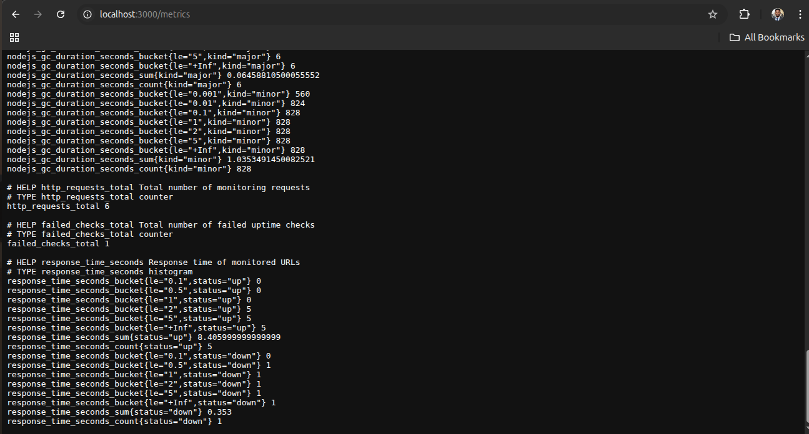

#### 🐳 Step 9: Containerize the Monitoring Application

Create:

```bash
app/Dockerfile
```

Containerization ensures:

* Consistent runtime behavior
* Simplified deployment
* Integration with the observability stack
* Reproducible development environments

#### 🧪 Step 10: Validate Monitoring API

#### Start the Application

```bash
node server.js
```

#### Test URL Monitoring

```bash
curl -X POST http://localhost:3000/monitor \
-H "Content-Type: application/json" \
-d '{"url":"https://google.com"}'
```

#### 📸 API Monitoring Test

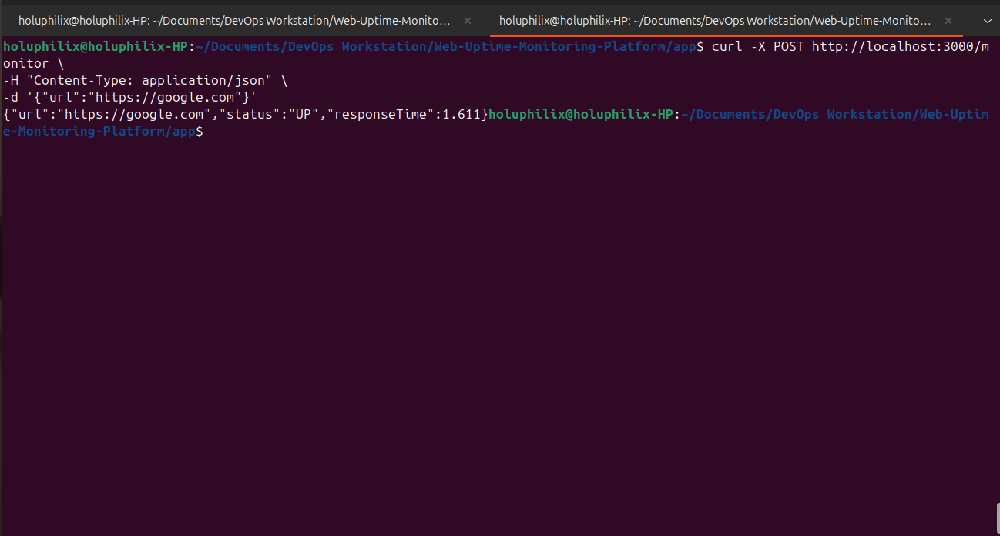

#### 🗄️ Step 11: Validate Monitoring Data Persistence

The platform stores monitoring targets and historical monitoring results in PostgreSQL for persistence and historical analysis.

#### Verify Stored Monitoring Results

```sql
SELECT * FROM monitored_urls;

SELECT * FROM check_results;
```

#### 📸 PostgreSQL Monitoring Records

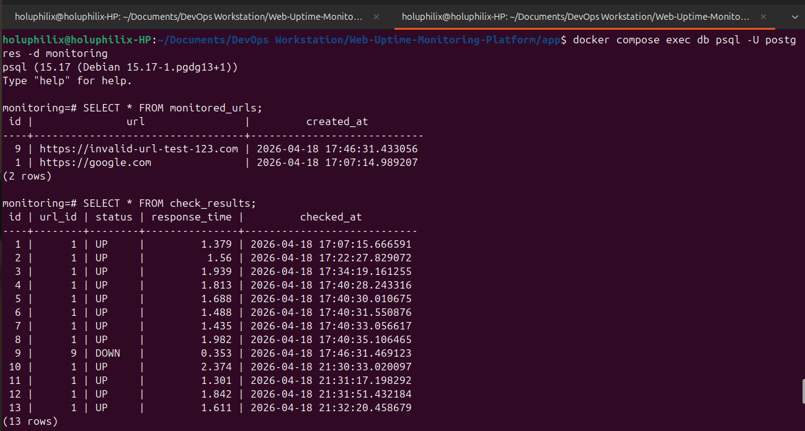

### 🎯 Validation Criteria

The monitoring application layer is considered operational when:

* Monitoring targets can be registered ✅
* Availability checks execute successfully ✅
* Response times are measured correctly ✅
* Metrics are exposed through `/metrics` ✅
* Prometheus successfully scrapes application metrics ✅
* Monitoring data persists in PostgreSQL ✅

### ⚠️ Common Issues Encountered

Common implementation issues included:

* Missing JSON body parsing
* Invalid URL handling
* Incorrect metric registration
* Missing `/metrics` exposure
* Docker networking misconfiguration
* Prometheus scrape configuration errors

### 💪 Outcome

At this stage, the platform provides a fully operational monitoring application capable of:

* Dynamic monitoring target onboarding
* Automated uptime validation
* Response time measurement
* Prometheus metrics generation
* Persistent monitoring history
* Integration with the centralized observability stack

This transforms the platform from a static observability setup into an API-driven monitoring system.

## 🚀 Task 3: Implement Persistent Monitoring Storage

### 🎯 Objective

Introduce persistent storage into the monitoring platform to enable:

* Service registration persistence
* Historical uptime tracking
* Response-time history retention
* Stateful monitoring operations

This transforms the platform from a stateless monitoring API into a persistent observability system.

### 🧠 Architectural Context

Modern monitoring platforms require historical visibility into service behavior over time.

Instead of performing temporary checks only, the platform now persists:

* Registered monitoring targets
* Monitoring execution history
* Availability states
* Performance measurements

This enables long-term operational analysis and service observability.

#### 🧱 Step 1: Define Database Schema

Create:

```bash
database/init.sql
```

#### PostgreSQL Schema

```sql
CREATE TABLE monitored_urls (
    id SERIAL PRIMARY KEY,
    url TEXT UNIQUE NOT NULL,
    created_at TIMESTAMP DEFAULT CURRENT_TIMESTAMP
);

CREATE TABLE check_results (
    id SERIAL PRIMARY KEY,
    url_id INTEGER REFERENCES monitored_urls(id) ON DELETE CASCADE,
    status VARCHAR(10),
    response_time FLOAT,
    checked_at TIMESTAMP DEFAULT CURRENT_TIMESTAMP
);
```

#### 🗄️ Database Design Overview

The persistence layer is divided into two primary tables:

#### `monitored_urls`

Stores registered monitoring targets.

#### `check_results`

Stores historical monitoring executions including:

* Availability state
* Response latency
* Execution timestamp

This structure enables historical uptime analysis and future dashboard expansion.

#### 📦 Step 2: Install PostgreSQL Driver

```bash
npm install pg
```

The `pg` package enables communication between the Node.js application and PostgreSQL.

#### 🔌 Step 3: Configure Database Connection

Create:

```bash
src/db/index.js
```

#### PostgreSQL Connection Configuration

```javascript
const { Pool } = require('pg');

const pool = new Pool({
  user: 'postgres',
  host: 'db',
  database: 'monitoring',
  password: 'postgres',
  port: 5432,
});

module.exports = pool;
```

#### 🧠 Step 4: Implement Database Query Layer

Create:

```bash
src/db/queries.js
```

The query layer handles:

* Monitoring target registration
* URL lookup and reuse
* Monitoring result persistence

#### Monitoring Query Operations

```javascript
const pool = require('./index');

// Register or retrieve URL
async function getOrCreateUrl(url) {
  const result = await pool.query(
    `INSERT INTO monitored_urls (url)
     VALUES ($1)
     ON CONFLICT (url) DO UPDATE SET url = EXCLUDED.url
     RETURNING id`,
    [url]
  );

  return result.rows[0].id;
}

// Store monitoring result
async function saveCheckResult(urlId, status, responseTime) {
  await pool.query(
    `INSERT INTO check_results (url_id, status, response_time)
     VALUES ($1, $2, $3)`,
    [urlId, status, responseTime]
  );
}

module.exports = {
  getOrCreateUrl,
  saveCheckResult,
};
```

#### 🔧 Step 5: Integrate Persistence into Monitoring Service

Update:

```bash
src/services/monitorService.js
```

Additional responsibilities introduced:

* Register monitoring targets automatically
* Persist uptime results after every check
* Store response latency history
* Maintain monitoring state over time

This integration ensures all monitoring activity becomes traceable and queryable.

#### 🐳 Step 6: Add PostgreSQL Service to Docker Compose

Update:

```bash
docker-compose.yml
```

#### PostgreSQL Service Definition

```yaml
db:
  image: postgres:15
  restart: always
  environment:
    POSTGRES_USER: postgres
    POSTGRES_PASSWORD: postgres
    POSTGRES_DB: monitoring
  volumes:
    - ./database/init.sql:/docker-entrypoint-initdb.d/init.sql
  ports:
    - "5432:5432"
```

#### 🔗 Step 7: Connect Application Layer to Database

Ensure the monitoring application depends on PostgreSQL.

#### Application Dependency Configuration

```yaml
app:
  build: ./app
  ports:
    - "3000:3000"
  depends_on:
    - db
```

This guarantees the database service initializes before the application starts.

#### 🚀 Step 8: Build and Start the Platform

```bash
docker compose up -d --build
```

This rebuilds the application and initializes the PostgreSQL database schema automatically.

#### 🧪 Step 9: Validate Monitoring API

#### Execute Monitoring Request

```bash
curl -X POST http://localhost:3000/monitor \
-H "Content-Type: application/json" \
-d '{"url":"https://google.com"}'
```

#### 📸 API Monitoring Validation


#### 🔍 Step 10: Validate Persistent Monitoring Data

Access PostgreSQL through Docker Compose:

```bash
docker compose exec db psql -U postgres -d monitoring
```

#### Verify Registered Monitoring Targets

```sql
SELECT * FROM monitored_urls;
```

#### Verify Historical Monitoring Results

```sql
SELECT * FROM check_results;
```

#### 📸 PostgreSQL Monitoring Records


The database now stores:

* Registered monitoring targets
* Historical uptime records
* Response latency history
* Failure states
* Monitoring timestamps

### 🎯 Validation Criteria

The persistence layer is considered operational when:

* Monitoring targets are stored successfully ✅
* Monitoring results persist correctly ✅
* Historical records remain queryable ✅
* PostgreSQL initializes automatically ✅
* API functionality remains operational ✅

### ⚠️ Common Issues Encountered

Common implementation issues included:

* Using `localhost` instead of Docker service name (`db`)
* Missing database initialization mount
* Failure to rebuild containers after schema changes
* Missing application dependency ordering
* PostgreSQL connection timing issues

### 💪 Outcome

At this stage, the platform now supports:

* Persistent monitoring target registration
* Historical uptime tracking
* Stateful monitoring operations
* Long-term observability analysis
* Structured monitoring data retention

This transforms the platform into a production-style monitoring system with persistent operational visibility.

## 🚀 Task 4: Implement Continuous Background Monitoring

### 🎯 Objective

Introduce automated background monitoring to enable:

* Continuous uptime validation
* Scheduled monitoring execution
* Automated observability updates
* Real-time monitoring without manual API requests

This transforms the platform from an on-demand monitoring system into an automated monitoring service.

### 🧠 Architectural Context

Production monitoring platforms continuously execute health checks in the background without requiring manual interaction.

Instead of relying on API-triggered checks only, the platform now:

* Continuously monitors registered targets
* Executes scheduled uptime validation
* Automatically updates metrics
* Continuously persists monitoring history

This introduces the platform’s automation layer.

#### 🧱 Step 1: Create Scheduler Module

Inside the application source directory:

```bash
mkdir -p src/scheduler
touch src/scheduler/scheduler.js
```

#### ⚙️ Step 2: Implement Background Scheduler

Create:

```bash
src/scheduler/scheduler.js
```

#### Scheduler Responsibilities

The scheduler is responsible for:

* Retrieving registered monitoring targets
* Executing monitoring checks automatically
* Running monitoring cycles continuously
* Updating monitoring history and metrics

#### Scheduler Implementation

```javascript
const { monitorUrl } = require('../services/monitorService');
const pool = require('../db');

async function runMonitoringCycle() {
  try {
    const res = await pool.query('SELECT url FROM monitored_urls');
    const urls = res.rows;

    for (const row of urls) {
      const url = row.url;

      console.log(`Checking: ${url}`);

      await monitorUrl(url);
    }

  } catch (error) {
    console.error('Scheduler error:', error.message);
  }
}

function startScheduler() {
  console.log('🚀 Background monitoring started...');

  // Execute every 30 seconds
  setInterval(runMonitoringCycle, 30000);
}

module.exports = { startScheduler };
```

#### 🔧 Step 3: Integrate Scheduler into Application Startup

Update:

```bash
server.js
```

#### Import Scheduler Module

```javascript
const { startScheduler } = require('./src/scheduler/scheduler');
```

#### Start Scheduler During Application Initialization

```javascript
app.listen(PORT, () => {
  console.log(`Server running on port ${PORT}`);

  startScheduler();
});
```

This ensures continuous monitoring begins automatically when the application starts.

#### 🚀 Step 4: Start the Monitoring Platform

Run the application:

```bash
node server.js
```

The scheduler now starts automatically alongside the API service.

#### 🧪 Step 5: Verify Background Monitoring Execution

Once the application starts, monitoring cycles begin automatically.

#### Expected Scheduler Output

```bash
🚀 Background monitoring started...

Checking: https://google.com
Checking: https://invalid-url-test-123.com
```

The scheduler continuously executes monitoring checks at the configured interval.

#### 📸 Scheduler Execution

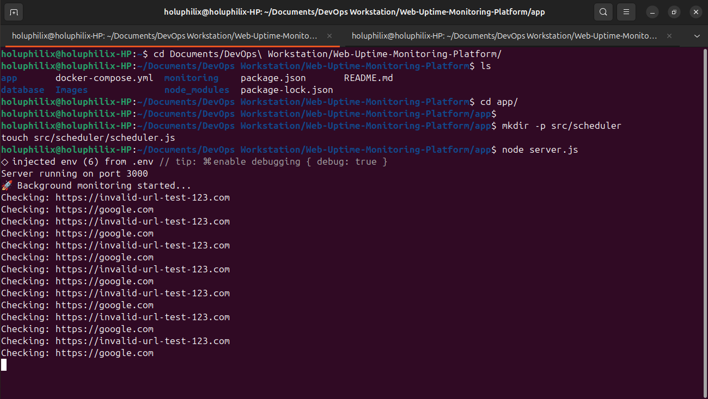

#### 🔍 Step 6: Validate Automated Database Updates

Wait for multiple monitoring cycles to complete, then access PostgreSQL:

```bash
docker compose exec db psql -U postgres -d monitoring
```

Run:

```sql
SELECT * FROM check_results;
```

You should observe new monitoring records being inserted automatically over time.

This confirms:

* Continuous monitoring execution
* Automated persistence
* Historical monitoring growth

#### 📊 Step 7: Validate Continuous Metrics Updates

Verify metrics generation:

```bash
curl http://localhost:3000/metrics
```

The metrics endpoint should continuously update without requiring manual monitoring requests.

This confirms:

* Prometheus metrics are updating automatically
* Background monitoring is operational
* Observability data is continuously generated

### 🔄 Continuous Monitoring Workflow

The automated monitoring lifecycle now operates as follows:

1. Scheduler retrieves registered targets
2. Monitoring service executes health checks
3. Results are stored in PostgreSQL
4. Metrics are updated automatically
5. Prometheus scrapes updated observability data
6. Grafana visualizes real-time monitoring information

This establishes a production-style automated monitoring pipeline.

### 🎯 Validation Criteria

The automation layer is considered operational when:

* Scheduler starts automatically ✅
* Registered URLs are monitored continuously ✅
* Monitoring results persist automatically ✅
* Metrics update without manual API execution ✅
* Monitoring cycles execute repeatedly at intervals ✅

### ⚠️ Common Issues Encountered

Common implementation issues included:

* Forgetting to initialize `startScheduler()`
* Incorrect scheduler import path
* Database connection timing issues
* Failure to restart the application after scheduler integration
* Incorrect monitoring service function references

### 💪 Outcome

At this stage, the platform now supports:

* Fully automated background monitoring
* Continuous uptime validation
* Automated observability generation
* Real-time monitoring execution
* Persistent monitoring history growth

This transforms the platform into a continuously operating monitoring system aligned with real-world observability workflows.

## 🚀 Task 5: Enhance Metrics Instrumentation & Labeling

### 🎯 Objective

Enhance the observability layer by introducing structured Prometheus labels and richer monitoring metrics.

This enables:

* Improved Prometheus querying
* Better Grafana visualization
* More granular monitoring visibility
* Clear distinction between healthy and failed monitoring states

The platform now moves beyond basic metrics into production-style observability instrumentation.

### 🧠 Observability Engineering Context

Modern observability systems rely heavily on labeled metrics for filtering, aggregation, and operational analysis.

Instead of collecting generic counters only, the platform now generates metrics enriched with contextual labels such as:

* `status`
* `url`
* `service`

This improves:

* Query precision
* Dashboard quality
* Alert targeting
* Operational visibility

#### 🧱 Step 1: Enhance Metrics Definitions

Update:

```bash
src/metrics/metrics.js
```

The metrics layer was enhanced to support structured Prometheus labels and richer observability data.

#### Enhanced Metrics Instrumentation

```javascript
const client = require('prom-client');

const register = new client.Registry();

client.collectDefaultMetrics({ register });

// Total monitoring requests
const httpRequestsTotal = new client.Counter({
  name: 'http_requests_total',
  help: 'Total number of monitoring requests',
  labelNames: ['status'],
});

// Failed monitoring checks
const failedChecksTotal = new client.Counter({
  name: 'failed_checks_total',
  help: 'Total number of failed uptime checks',
});

// Response time histogram
const responseTimeHistogram = new client.Histogram({
  name: 'response_time_seconds',
  help: 'Response time of monitored URLs',
  labelNames: ['status'],
  buckets: [0.1, 0.5, 1, 2, 5],
});

// Current uptime state
const uptimeStatus = new client.Gauge({
  name: 'uptime_status',
  help: 'Current uptime status (1 = up, 0 = down)',
});

register.registerMetric(httpRequestsTotal);
register.registerMetric(failedChecksTotal);
register.registerMetric(responseTimeHistogram);
register.registerMetric(uptimeStatus);

module.exports = {
  register,
  httpRequestsTotal,
  failedChecksTotal,
  responseTimeHistogram,
  uptimeStatus,
};
```

#### 🔍 Metrics Overview

The enhanced metrics layer now tracks:

#### `http_requests_total`

Tracks total monitoring executions categorized by status.

#### `failed_checks_total`

Tracks failed uptime validations.

#### `response_time_seconds`

Captures latency distributions through histogram buckets.

#### `uptime_status`

Represents the current service availability state.

#### 🔧 Step 2: Enhance Monitoring Logic

Update:

```bash
src/services/monitorService.js
```

The monitoring service was updated to generate labeled metrics dynamically during monitoring execution.

#### Enhanced Monitoring Logic

```javascript
const axios = require('axios');

const {
  httpRequestsTotal,
  failedChecksTotal,
  responseTimeHistogram,
  uptimeStatus,
} = require('../metrics/metrics');

const { getOrCreateUrl, saveCheckResult } = require('../db/queries');

async function checkUrl(url) {
  const start = Date.now();

  let status = 'DOWN';
  let duration = 0;

  try {
    await axios.get(url);

    duration = (Date.now() - start) / 1000;
    status = 'UP';

    httpRequestsTotal.labels('up').inc();
    responseTimeHistogram.labels('up').observe(duration);
    uptimeStatus.set(1);

  } catch (error) {
    duration = (Date.now() - start) / 1000;

    httpRequestsTotal.labels('down').inc();
    failedChecksTotal.inc();
    responseTimeHistogram.labels('down').observe(duration);
    uptimeStatus.set(0);
  }

  // Save to database
  const urlId = await getOrCreateUrl(url);
  await saveCheckResult(urlId, status, duration);

  return {
    url,
    status,
    responseTime: duration,
  };
}

module.exports = { checkUrl };
```

#### 🚀 Step 3: Restart the Monitoring Application

Restart the application to apply the new metrics instrumentation.

```bash
node server.js
```

#### 🧪 Step 4: Trigger Monitoring Execution

Execute a monitoring request:

```bash
curl -X POST http://localhost:3000/monitor \
-H "Content-Type: application/json" \
-d '{"url":"https://google.com"}'
```

This generates labeled Prometheus metrics automatically.

#### 🔍 Step 5: Verify Metrics Output

Access the metrics endpoint:

```bash
curl http://localhost:3000/metrics
```

The metrics output should now include labeled observability data.

#### 📸 Metrics with Labels

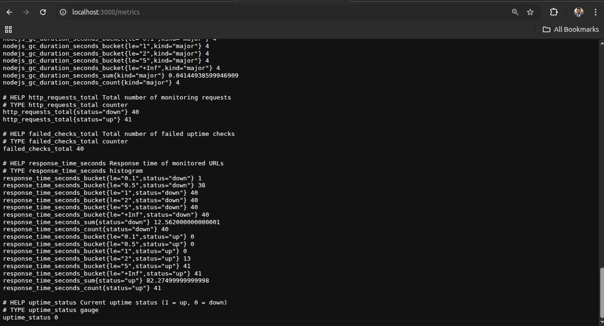

### 📊 Observability Improvements

The platform now provides:

* Status-aware metrics (`up` / `down`)
* Latency distribution visibility
* Structured histogram buckets
* Query-ready Prometheus data
* Improved Grafana dashboard compatibility

This significantly improves monitoring visibility and operational analysis.

### 🎯 Validation Criteria

The enhanced observability layer is considered operational when:

* Metrics expose labels correctly ✅
* UP and DOWN states are tracked independently ✅
* Histogram buckets capture response-time distributions ✅
* Metrics update continuously through scheduler execution ✅
* Prometheus can query labeled metrics successfully ✅

### ⚠️ Common Issues Encountered

Common implementation issues included:

* Forgetting to use `.labels()`
* Incorrect metric registration
* Missing application restart after instrumentation changes
* Misconfigured histogram labels
* Inconsistent metric naming

### 💪 Outcome

At this stage, the platform now supports:

* Structured Prometheus instrumentation
* Labeled observability metrics
* Enhanced monitoring visibility
* Query-optimized metrics
* Dashboard-ready telemetry

This establishes a more production-aligned observability foundation capable of supporting advanced alerting and visualization workflows.

## 🚀 Task 6: Alerting System (Incident Response Layer)

### 🎯 Objective

Implement an automated alerting pipeline to transform the monitoring platform from passive observability into an active incident response system.

This enables:

* Automatic downtime detection
* Real-time alert generation
* Alert routing and notification delivery
* Faster operational response to incidents

👉 This layer introduces production-style alert management and operational visibility.

### 🧠 Platform Engineering Context

In modern platform environments:

* Monitoring alone is insufficient
* Systems must automatically detect failures and notify operators
* Alerting must be centralized, standardized, and reusable

👉 This layer introduces:

* **Prometheus Alert Rules** → define incident conditions
* **Alertmanager Routing** → process and distribute alerts
* **Slack Notifications** → provide real-time operational awareness

#### 🧱 Step 1: Define Alert Rules

Update:

```bash
monitoring/prometheus/alert.rules.yml
```

```yaml
groups:

  - name: system-alerts
    rules:

      - alert: HighCPUUsage
        expr: 100 - (avg by(instance)(rate(node_cpu_seconds_total{mode="idle"}[1m])) * 100) > 80
        for: 1m
        labels:
          severity: warning
        annotations:
          summary: "High CPU usage detected"

  - name: uptime-alerts
    rules:

      - alert: WebsiteDown
        expr: uptime_status == 0
        for: 1m
        labels:
          severity: critical
          service: uptime-monitor
        annotations:
          summary: "Website DOWN"
          description: "Website {{ $labels.url }} is not reachable."

      - alert: HighResponseTime
        expr: response_time_seconds > 2
        for: 1m
        labels:
          severity: warning
          service: uptime-monitor
        annotations:
          summary: "High Response Time"
          description: "Website {{ $labels.url }} is responding slowly."
```

👉 These rules define standardized alert conditions for uptime and performance monitoring.

#### 📦 Step 2: Ensure Prometheus Loads Alert Rules

Update:

```bash
monitoring/prometheus/prometheus.yml
```

Ensure:

```yaml
rule_files:
  - "alert.rules.yml"
```

👉 Prometheus automatically evaluates alert conditions using these rules.

#### 🔌 Step 3: Configure Alertmanager with Slack

Update:

```bash
monitoring/alertmanager/alertmanager.yml
```

```yaml
global:
  resolve_timeout: 5m

route:
  receiver: "slack-notifications"

receivers:
  - name: "slack-notifications"
    slack_configs:
      - api_url: "${SLACK_WEBHOOK_URL}"
        channel: "#uptime-monitoring-alerts"
        send_resolved: true

        title: |
          {{ if eq .Status "resolved" }}
          ✅ Website RESOLVED
          {{ else }}
          🚨 Website DOWN
          {{ end }}

        text: |
          *{{ if eq .Status "resolved" }}✅ Website Monitoring RESOLVED{{ else }}🚨 Website Monitoring Alert{{ end }}*

          Alert: {{ .CommonLabels.alertname }}
          Status: {{ if eq .Status "resolved" }}🟢 RESOLVED{{ else }}🔴 DOWN{{ end }}
          Severity: {{ .CommonLabels.severity }}
          Website: {{ .CommonLabels.url }}

          Message:
          {{ if eq .Status "resolved" }}
          Website is back to normal
          {{ else }}
          Website is not reachable
          {{ end }}

          Time:
          {{ .StartsAt }}
```

👉 Alertmanager routes alerts from Prometheus directly to Slack for operational visibility.

#### 🐳 Step 4: Restart Monitoring Stack

```bash
docker compose down
docker compose up -d
```

👉 Restarting ensures Prometheus and Alertmanager reload updated configurations.

#### 🧪 Step 5: Trigger Failure Scenario

Run a monitoring request against an invalid URL:

```bash
curl -X POST http://localhost:3000/monitor \
-H "Content-Type: application/json" \
-d '{"url":"https://google-invalid.com"}'
```

👉 You can also allow the background scheduler to detect failures automatically.

#### 🔍 Step 6: Verify Alerts in Prometheus

Open:

```text
http://localhost:9091/alerts
```

Expected behavior:

* `WebsiteDown` → FIRING 🔴
* `HighResponseTime` → depends on latency
* Alert transitions to INACTIVE after recovery

#### 📸 Active Incident Detected in Prometheus

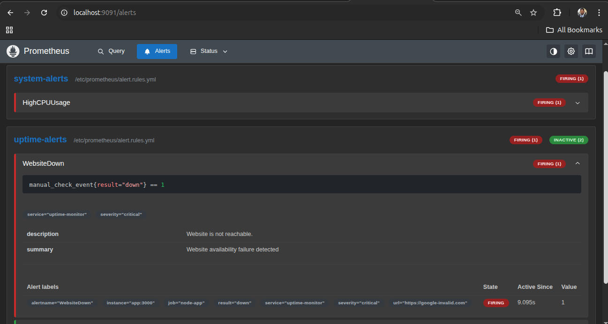

👉 Prometheus successfully detected service downtime and transitioned the alert into the `FIRING` state.

#### 📸 Alert Recovery State in Prometheus

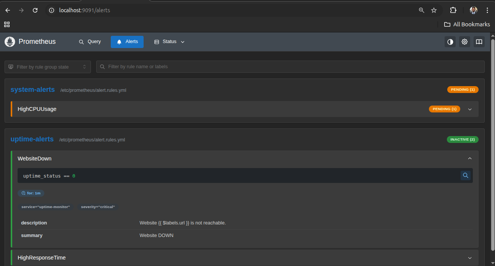

👉 After service recovery, the alert automatically transitioned back to the `INACTIVE` state.

#### 🔔 Step 7: Verify Slack Notifications

Alertmanager automatically sends incident notifications to Slack.

#### 📸 Slack Incident Notification (Downtime)

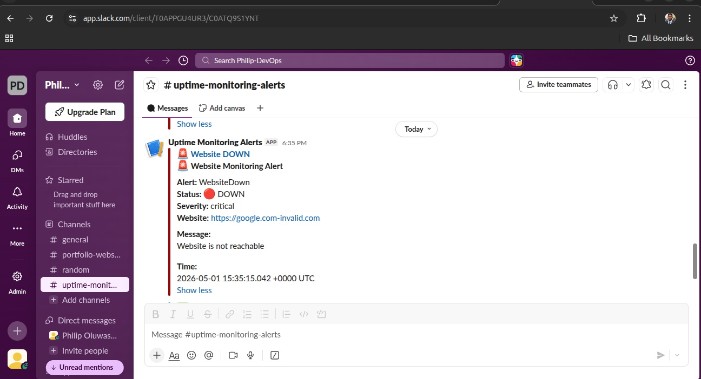

👉 Alertmanager successfully routed downtime notifications to Slack for real-time operational visibility.

#### 📸 Slack Recovery Notification

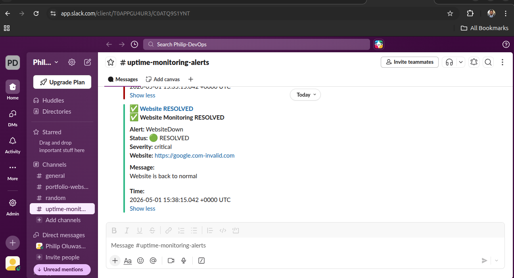

👉 Recovery notifications were automatically delivered after the monitored service returned to a healthy state.

### 🎯 Success Criteria

* Prometheus alert rules are configured correctly ✅
* Downtime incidents are automatically detected ✅
* Alerts transition through lifecycle states correctly ✅
* Alertmanager successfully routes alerts ✅
* Slack receives real-time incident notifications ✅
* Recovery notifications are automatically delivered ✅

### ⚠️ Common Mistakes

* Incorrect metric names in alert expressions ❌
* Slack webhook not configured properly ❌
* Forgetting `send_resolved: true` ❌
* Not restarting Prometheus or Alertmanager ❌
* Using incorrect alert thresholds ❌

### 💪 Outcome

You have successfully implemented the **Incident Response Layer**, enabling:

* Automated failure detection
* Real-time alert generation
* Centralized alert routing
* Slack-based operational notifications
* Full incident lifecycle visibility

👉 The platform now supports production-style observability and incident management workflows.

## 🚀 Task 7: Grafana Dashboards (Visualization Layer)

### 🎯 Objective

Implement a visualization layer to transform raw monitoring metrics into real-time operational insights.

This enables:

* Real-time visibility into service health
* Performance trend analysis
* Faster troubleshooting and incident investigation
* Operational observability through dashboards

👉 This layer converts Prometheus metrics into actionable visual intelligence.

### 🧠 Platform Engineering Context

In modern platform environments:

* Raw metrics alone are insufficient
* Engineering teams require centralized and reusable dashboards
* Visualization improves operational awareness and incident response

👉 This layer introduces:

* **Grafana Dashboards** → visualize monitoring metrics
* **Prometheus Data Source** → query observability data
* **Reusable Visualization Layer** → shared across monitored services

#### 🧱 Step 1: Access Grafana

Open:

```text
http://localhost:4000
```

Login credentials:

```text
Username: admin
Password: admin
```

👉 Grafana provides the centralized visualization interface for platform observability.

#### 🔌 Step 2: Configure Prometheus Data Source

1. Navigate to:

```text
Connections → Data Sources
```

2. Click:

```text
Add data source
```

3. Select:

```text
Prometheus
```

#### Configure the Prometheus endpoint:

```text
URL: http://prometheus:9090
```

4. Click:

```text
Save & Test
```

Expected result:

```text
Successfully queried the Prometheus API.
```

#### 📸 Grafana Prometheus Data Source

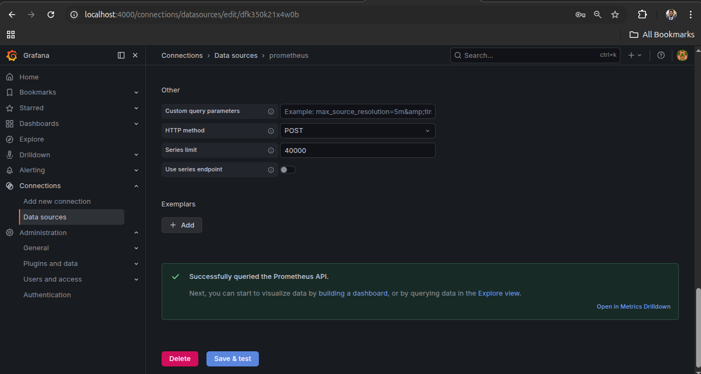

👉 Grafana is now connected to Prometheus and can query monitoring metrics in real time.

#### 📊 Step 3: Create Monitoring Dashboard

Navigate to:

```text
Dashboards → New Dashboard → Add Visualization
```

👉 Multiple panels will be created to visualize uptime, traffic, failures, and response time metrics.

#### 📌 Panel 1: Uptime Status

##### Query

```promql
uptime_status
```

##### Visualization

```text
Time Series
```

👉 Displays service availability status over time:

* `1` → Service UP
* `0` → Service DOWN

#### 📸 Uptime Status Visualization

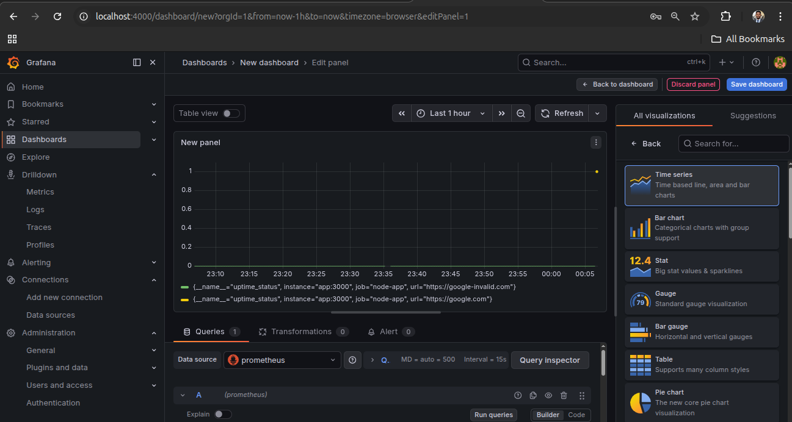

👉 Provides immediate visibility into service availability and uptime behavior.

#### 📌 Panel 2: Request Volume

##### Query

```promql
http_requests_total
```

##### Visualization

```text
Time Series
```

👉 Displays monitoring request activity and traffic trends over time.

#### 📸 Request Volume Visualization

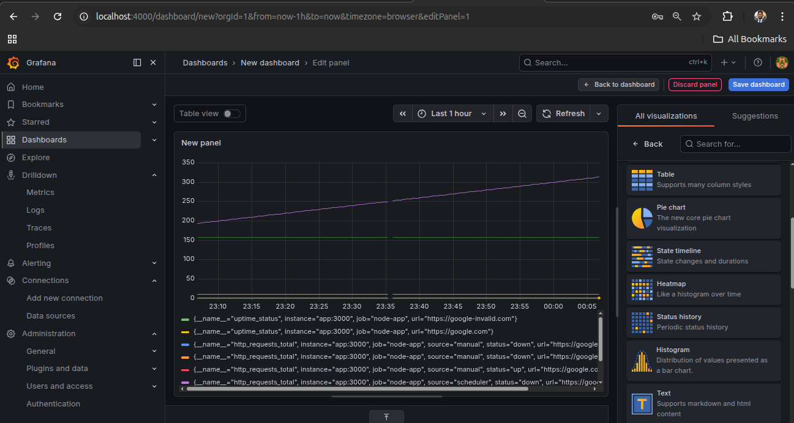

👉 Helps identify monitoring activity patterns and request growth over time.

#### 📌 Panel 3: Failed Checks

##### Query

```promql
failed_checks_total
```

##### Visualization

```text
Time Series
```

👉 Displays accumulated monitoring failures detected by the platform.

#### 📸 Failed Checks Visualization

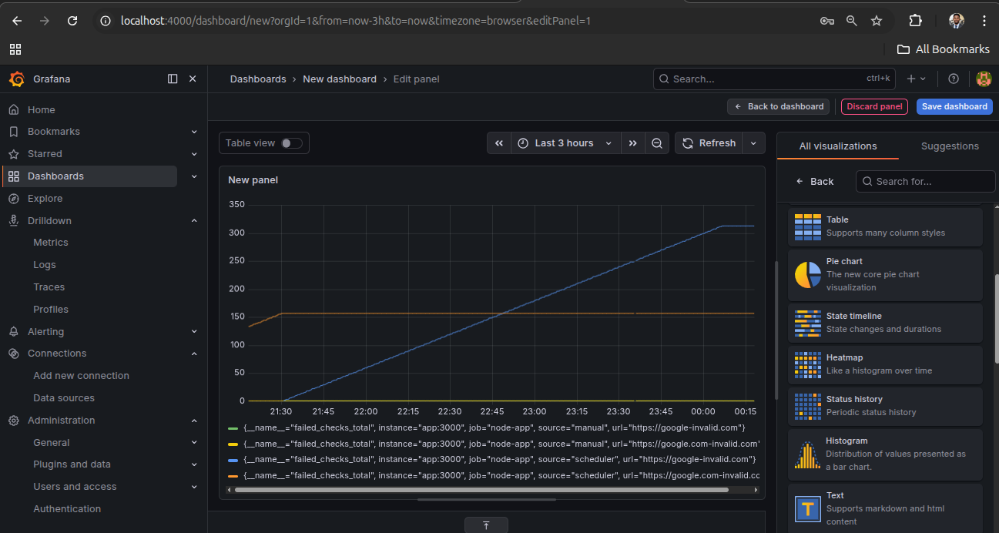

👉 Helps operators quickly identify recurring service failures and instability trends.

#### 📌 Panel 4: Response Time Monitoring

##### Query

```promql
response_time_seconds_sum
```

##### Visualization

```text
Time Series
```

👉 Displays response latency trends for monitored services.

#### 📸 Response Time Visualization

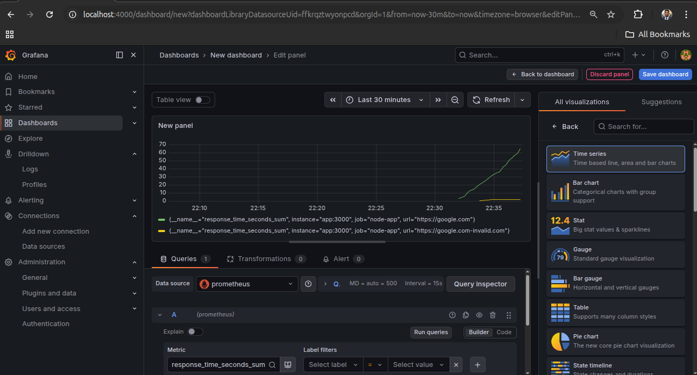

👉 Provides visibility into application responsiveness and performance degradation.

#### 🎨 Step 4: Improve Dashboard Readability

Enhance dashboard presentation for operational usability:

##### Rename Dashboard

```text
Uptime Monitoring Platform
```

##### Recommended Panel Titles

* Service Availability
* Monitoring Request Volume
* Failure Detection
* Response Time Trend

##### Recommended Color Conventions

* Green → Healthy / UP
* Red → Failed / DOWN
* Yellow → Warning / High Latency

👉 Consistent visual design improves readability and operational response efficiency.

#### 🧪 Step 5: Validate Dashboard Updates

Trigger a monitoring failure:

```bash
curl -X POST http://localhost:3000/monitor \
-H "Content-Type: application/json" \
-d '{"url":"https://google-invalid.com"}'
```

Observe dashboard behavior:

* Uptime status changes
* Failure count increases
* Response metrics update
* Alerts begin firing

👉 Grafana updates automatically as Prometheus receives new metrics.

### 🎯 Success Criteria

* Grafana successfully connects to Prometheus ✅
* Monitoring metrics are visualized correctly ✅
* Uptime behavior is visible in real time ✅
* Request and failure metrics update automatically ✅
* Dashboard reflects live operational state ✅

### ⚠️ Common Mistakes

* Incorrect Prometheus URL configuration ❌
* Empty dashboards caused by missing metrics ❌
* No traffic generated for visualization ❌
* Using overly complex PromQL queries too early ❌
* Forgetting to save dashboard panels ❌

### 💪 Outcome

You have successfully implemented the **Visualization Layer**, enabling:

* Real-time operational visibility
* Centralized observability dashboards
* Performance and uptime analysis
* Human-readable monitoring insights

👉 The platform now provides full-stack observability across metrics, alerts, and visualization workflows.

## 🚀 Task 8: Self-Service Monitoring (Platform Engineering Layer)

### 🎯 Objective

Transform the monitoring system into a self-service platform where developers can onboard services dynamically without manual observability configuration.

This enables:

* Dynamic service registration
* Automated monitoring workflows
* Continuous background checks
* Fully integrated metrics, dashboards, and alerting

👉 The platform now behaves like an internal developer platform for observability.

### 🧠 Platform Engineering Context

In traditional monitoring systems:

* Engineers manually configure monitoring for each service
* Alerting and dashboards require additional setup

In a Platform Engineering model:

* Developers simply register their service
* The platform automatically provides:

  * Monitoring
  * Metrics collection
  * Alerting
  * Visualization

👉 This task introduces the core self-service experience expected in modern engineering platforms.

### 🔄 Platform Evolution

#### ❌ Previous Workflow

```text
User manually triggered monitoring checks through the API
```

#### ✅ New Workflow

```text
User registers URL → platform continuously monitors automatically
```

👉 Monitoring is now fully automated after onboarding.

#### 🧱 Step 1: Connect Scheduler with Service Registry

At this stage, the platform already includes:

* Persistent database storage ✅
* Background scheduler ✅
* Metrics collection ✅
* Alerting pipeline ✅

👉 The scheduler will now continuously monitor every registered URL automatically.

#### 🔧 Step 2: Update Scheduler Logic

Update:

```bash
app/src/scheduler/scheduler.js
```

```javascript
const cron = require("node-cron");
const { getAllUrls } = require("../db/queries");
const { monitorUrl } = require("../services/monitorService");

cron.schedule("* * * * *", async () => {
  console.log("Running scheduled monitoring...");

  try {
    const urls = await getAllUrls();

    for (const urlObj of urls) {
      await monitorUrl(urlObj.url);
    }

  } catch (error) {
    console.error("Scheduler error:", error.message);
  }
});
```

👉 The scheduler now acts as the platform automation engine.

#### 📸 Scheduler Running (Proof)

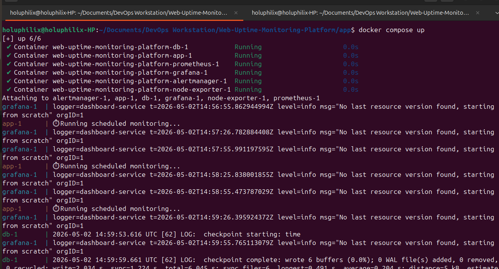

👉 Registered services are now monitored automatically at scheduled intervals.

#### 📦 Step 3: Fetch Registered URLs from Database

Update:

```bash
app/src/db/queries.js
```

```javascript
async function getAllUrls() {
  const result = await pool.query("SELECT url FROM monitored_urls");
  return result.rows;
}
```

👉 This allows the scheduler to dynamically retrieve all onboarded services.

#### 🔁 Step 4: Convert API into Registration Endpoint

Update:

```bash
app/src/controllers/monitorController.js
```

```javascript
const { getOrCreateUrl } = require("../db/queries");

async function registerUrl(req, res) {
  const { url } = req.body;

  try {
    await getOrCreateUrl(url);

    res.json({
      message: "URL registered successfully",
      url,
    });

  } catch (error) {
    res.status(500).json({
      error: error.message,
    });
  }
}

module.exports = { registerUrl };
```

👉 The API now performs service onboarding instead of manual monitoring execution.

#### 🌐 Step 5: Update API Route

Update:

```bash
app/src/routes/monitorRoutes.js
```

```javascript
router.post("/monitor", registerUrl);
```

👉 This endpoint now behaves as a self-service onboarding API.

#### 🧪 Step 6: Test Self-Service Registration

Register a new service:

```bash
curl -X POST http://localhost:3000/monitor \
-H "Content-Type: application/json" \
-d '{"url":"https://google.com"}'
```

Expected response:

```json
{
  "message": "URL registered successfully",
  "url": "https://google.com"
}
```

#### 📸 API Registration (Proof)

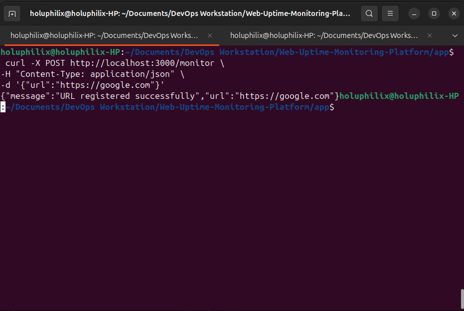

👉 The platform successfully onboarded the service dynamically.

### 🔄 Automated Monitoring Workflow

After registration:

* URL stored in PostgreSQL ✅
* Scheduler detects registered service ✅
* Continuous monitoring begins automatically ✅
* Metrics update continuously ✅
* Alerts trigger automatically when failures occur ✅
* Grafana dashboards reflect live status ✅

👉 The monitoring lifecycle is now fully automated.

#### 📸 Metrics Updating Automatically (Proof)

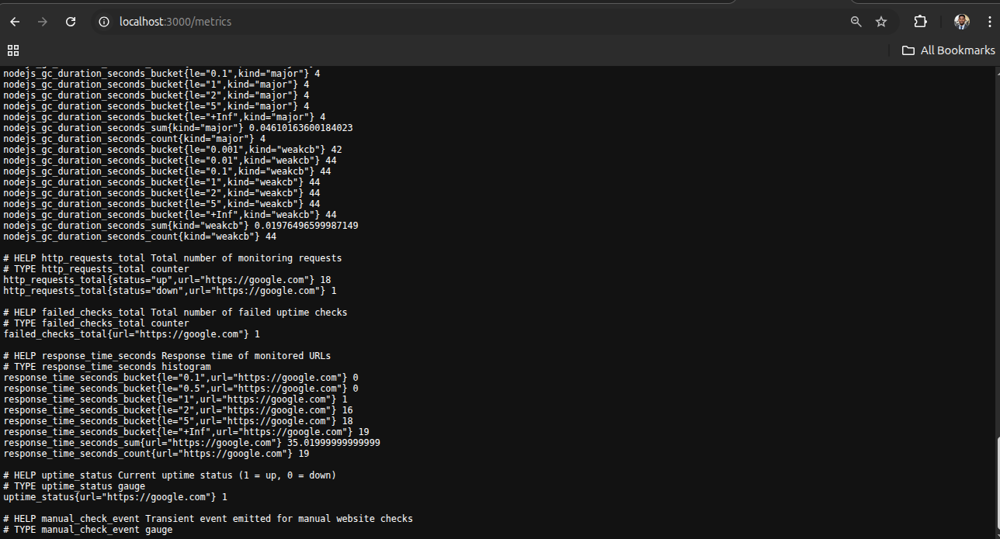

👉 Prometheus metrics continuously update without requiring manual API execution.

### 🎯 Success Criteria

* Services can be registered dynamically ✅
* Scheduler continuously monitors onboarded URLs ✅
* Monitoring runs automatically without manual API triggers ✅
* Metrics update continuously in Prometheus ✅
* Alerting and dashboards continue functioning correctly ✅

### ⚠️ Common Mistakes

* Forgetting to install `node-cron` ❌
* Scheduler not executing correctly ❌
* API still performing manual checks ❌
* Database queries not returning URLs ❌
* Not rebuilding containers after updates ❌

### 💪 Outcome

You have successfully implemented the **Self-Service Monitoring Layer**, enabling:

* Dynamic service onboarding
* Fully automated monitoring workflows
* Continuous observability pipelines
* Reusable platform monitoring capabilities

👉 The system now operates like a real internal Platform Engineering solution rather than a standalone monitoring application.

## 🚀 Task 9: Standardization & Reusability (Platform Engineering Layer)

### 🎯 Objective

Standardize the observability platform to ensure:

* Consistent metric structures
* Reusable alerting patterns
* Scalable monitoring architecture
* Predictable observability workflows

👉 This transforms the project from a functional monitoring system into a reusable and production-aligned observability platform.

### 🧠 Platform Engineering Context

In modern engineering organizations:

* Multiple services are monitored simultaneously
* Metrics must follow standardized conventions
* Alerting pipelines must remain predictable
* Observability systems must scale cleanly

Without standardization:

* Metrics become inconsistent
* Dashboards become difficult to maintain
* Alert routing becomes unreliable
* Platform scalability becomes limited

👉 This task introduces standardized observability design principles commonly used in production environments.

### 🔄 Platform Evolution

#### ❌ Before (Tasks 1–8)

```text
Metrics and alerts function correctly but lack standardized structure
```

#### ✅ After (Task 9)

```text
All observability components follow reusable and scalable conventions
```

👉 The platform now supports cleaner scaling and operational consistency.

#### 🧱 Step 1: Standardize Metric Labels

To improve scalability and observability consistency, all metrics now follow a unified labeling structure.

### ✅ Standardized Labels

| Label | Purpose |
|---|---|
| `service` | Identifies monitored platform/service |
| `url` | Identifies monitored endpoint |
| `status` | Indicates monitoring result (`up` / `down`) |

👉 This enables:

* Multi-service observability
* Label-based filtering
* Granular dashboard queries
* Structured alert routing
* Scalable monitoring patterns

### 🔧 Update Metrics Implementation

Update:

```bash
app/src/services/monitorService.js
```

#### HTTP Request Counter

```javascript
httpRequestsTotal.inc({
  service: "uptime-monitor",
  url,
  status: status.toLowerCase(),
});
```

#### Response Time Histogram

```javascript
responseTimeHistogram.observe(
  { service: "uptime-monitor", url, status: status.toLowerCase() },
  duration
);
```

#### Failed Checks Counter

```javascript
failedChecksTotal.inc({
  service: "uptime-monitor",
  url,
});
```

#### Uptime Status Metric

```javascript
setActiveWebsiteStatus(url, status, "uptime-monitor");
```

👉 Metrics now follow a production-style labeling strategy.

#### 📸 Metrics with Standardized Labels (Proof)

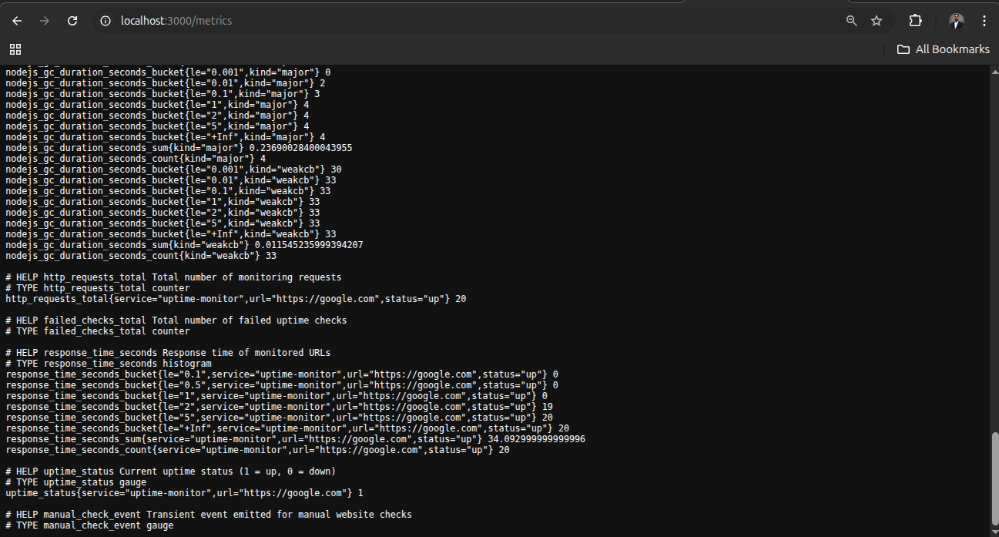

👉 The metrics output now includes:

* `service`
* `url`
* `status`

allowing structured observability queries across monitored services.

#### 🧱 Step 2: Standardize Alert Labels

Update:

```bash
monitoring/prometheus/alert.rules.yml
```

All alerts now include standardized labels for filtering, grouping, and routing.

### 🔴 WebsiteDown Alert

```yaml
- alert: WebsiteDown
  expr: uptime_status{service="uptime-monitor"} == 0
  for: 30s
  labels:
    severity: critical
    service: uptime-monitor
  annotations:
    summary: "Website Down"
    description: "Service {{ $labels.url }} is not reachable"
```

### 🟠 HighResponseTime Alert

```yaml
- alert: HighResponseTime
  expr: response_time_seconds{service="uptime-monitor"} > 2
  for: 30s
  labels:
    severity: warning
    service: uptime-monitor
  annotations:
    summary: "High Response Time"
    description: "Service {{ $labels.url }} is responding slowly"
```

👉 Alerts now support consistent filtering and routing behavior.

#### 📸 Alert Triggered (FIRING State)

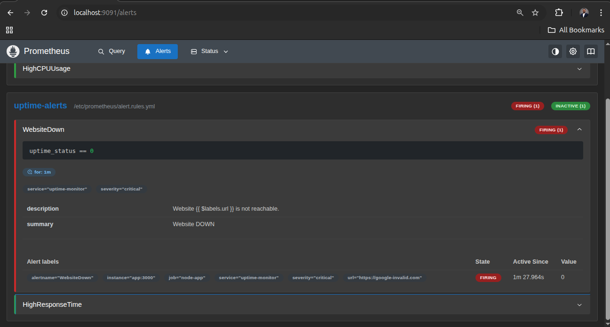

👉 Demonstrates:

* `WebsiteDown` alert firing correctly
* URL-specific detection
* Standardized service labeling
* Real-time incident visibility

#### 📸 Alert Resolved (System Recovery)


👉 Demonstrates:

* Automatic recovery detection
* Alert lifecycle transition
* Healthy state restoration

#### 📸 Alert Overview (All Rules)

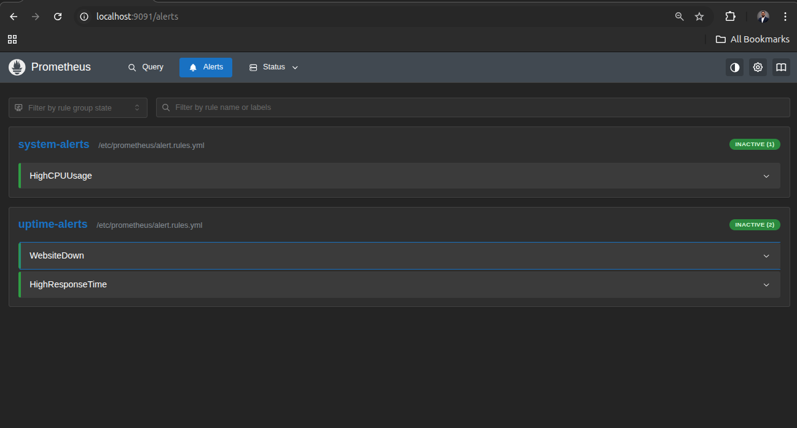

👉 Shows:

* Centralized alert visibility
* Structured alert grouping
* Standardized alert organization

#### 🔍 Prometheus Alerts Endpoint

```text
http://localhost:9091/alerts
```

👉 Alerts now include:

* Consistent labels
* Standardized naming
* Service-based filtering
* Clear operational visibility

#### 🧱 Step 3: Standardize Alert Naming

To maintain operational consistency, alerts now follow a predictable naming convention.

| Alert Category | Standardized Name |
|---|---|
| Downtime | `WebsiteDown` |
| Recovery | `WebsiteUp` |
| Performance | `HighResponseTime` |

👉 This improves:

* Readability
* Incident response workflows
* Automation compatibility
* Operational consistency

#### 🧱 Step 4: Align Alertmanager Routing

Update Alertmanager routing configuration:

```yaml
matchers:
  - service="uptime-monitor"
```

👉 This enables:

* Service-aware alert routing
* Scalable alert grouping
* Cleaner incident management
* Future multi-service expansion

#### 🧪 Step 5: Validate Standardization

### 🔍 Prometheus Query

```text
http_requests_total{service="uptime-monitor"}
```

#### 📸 Prometheus Query Result (Proof)

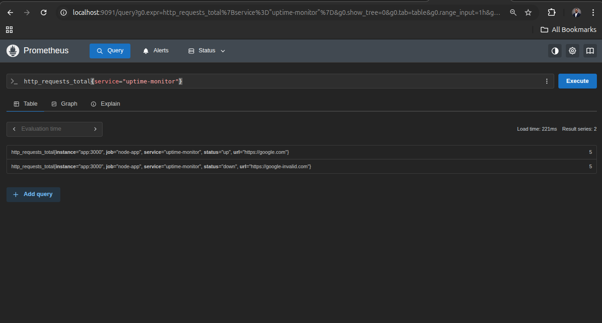

👉 Confirms:

* Metrics are filterable by service
* URL-based monitoring is functioning
* Status labels are applied consistently

### 🔍 Metrics Endpoint

```text
http://localhost:3000/metrics
```

#### 📸 Metrics Output (Proof)


👉 Confirms:

* Structured metric output
* Standardized labels
* Production-style observability formatting

### 🎯 Success Criteria

* Metrics include standardized labels (`service`, `url`, `status`) ✅
* Alerts use consistent labeling structure ✅
* Alert naming conventions are standardized ✅
* Prometheus queries support service-level filtering ✅
* Alertmanager routing aligns with standardized labels ✅
* Platform observability structure is reusable and scalable ✅

### ⚠️ Common Mistakes

* Adding labels in code but not updating metric definitions ❌
* Missing `service` labels in alert rules ❌
* Inconsistent alert naming conventions ❌
* Forgetting to restart services after updates ❌
* Overusing high-cardinality labels unnecessarily ❌

### 💪 Outcome

You have successfully implemented the **Standardization & Reusability Layer**, enabling:

* Consistent observability architecture
* Scalable monitoring workflows
* Reusable platform monitoring patterns
* Cleaner integration across metrics, alerts, and dashboards

👉 The platform now reflects production-style observability engineering practices commonly used in modern Platform Engineering environments.

## 🚀 Task 10: Containerized Platform Deployment (Platform Engineering Layer)

### 🎯 Objective

Containerize and orchestrate the entire monitoring platform using **Docker Compose**, enabling:

* Consistent environment setup
* Reliable service-to-service communication
* Persistent data storage
* Simplified deployment workflow

👉 This transforms the system into a **fully portable and production-like monitoring platform**.

### 🧠 Platform Engineering Context

In modern production environments:

* Applications run inside isolated containers
* Services communicate through internal container networking
* Infrastructure must remain reproducible across environments
* Persistent storage must survive container restarts

👉 Containerization ensures the monitoring platform behaves like a real-world deployment architecture.

### 🔄 Platform Evolution

#### ❌ Before (Tasks 1–9)

```text
Services run independently and require manual coordination
```

#### ✅ After (Task 10)

```text
Entire platform runs through a unified and reproducible containerized stack
```

👉 The platform is now portable, scalable, and deployment-ready.

#### 🧱 Step 1: Define Services in Docker Compose

Update:

```bash
docker-compose.yml
```

The platform now includes:

* **App** → Node.js Monitoring API
* **Database** → PostgreSQL
* **Prometheus** → Metrics collection
* **Grafana** → Visualization layer
* **Alertmanager** → Alert routing
* **Node Exporter** → Host-level metrics

### 🔧 Docker Compose Configuration

```yaml
services:

  app:
    build: ./app
    ports:
      - "3000:3000"
    environment:
      DB_HOST: db
      DB_PORT: 5432
      DB_USER: postgres
      DB_PASSWORD: postgres
      DB_NAME: monitoring
      PORT: 3000
    depends_on:
      db:
        condition: service_healthy
    restart: unless-stopped

  db:
    image: postgres:15
    restart: always
    environment:
      POSTGRES_USER: postgres
      POSTGRES_PASSWORD: postgres
      POSTGRES_DB: monitoring
    volumes:
      - postgres_data:/var/lib/postgresql/data
      - ./database/init.sql:/docker-entrypoint-initdb.d/init.sql
    ports:
      - "5432:5432"
    healthcheck:
      test: ["CMD-SHELL", "pg_isready -U postgres"]
      interval: 5s
      timeout: 5s
      retries: 5

  prometheus:
    image: prom/prometheus
    ports:
      - "9091:9090"
    volumes:
      - ./monitoring/prometheus:/etc/prometheus
    command:
      - "--config.file=/etc/prometheus/prometheus.yml"
    depends_on:
      - app
    restart: unless-stopped

  grafana:
    image: grafana/grafana
    ports:
      - "4000:3000"
    volumes:
      - grafana_data:/var/lib/grafana
    depends_on:
      - prometheus
    restart: unless-stopped

  alertmanager:
    image: prom/alertmanager
    ports:
      - "9094:9093"
    volumes:
      - ./monitoring/alertmanager:/etc/alertmanager
    env_file:
      - ./app/.env
    command:
      - "--config.file=/etc/alertmanager/alertmanager.yml"
    restart: unless-stopped

  node-exporter:
    image: prom/node-exporter
    command:
      - '--path.rootfs=/host'
      - '--path.procfs=/host/proc'
      - '--path.sysfs=/host/sys'
      - '--collector.filesystem.mount-points-exclude=^/(sys|proc|dev|host|etc)($|/)'
    pid: host
    restart: unless-stopped
    volumes:
      - '/:/host:ro,rslave'
      - '/proc:/host/proc:ro'
      - '/sys:/host/sys:ro'

volumes:
  postgres_data:
  grafana_data:
```

#### 🧱 Step 2: Enable Internal Service Networking

Docker Compose automatically provides DNS-based internal networking.

👉 Services communicate using container service names:

| Service | Internal Hostname |
|---|---|
| PostgreSQL | `db` |
| Monitoring App | `app` |
| Prometheus | `prometheus` |
| Alertmanager | `alertmanager` |

### ⚠️ Important Configuration

Update:

```bash
app/.env
```

```env
DB_HOST=db
```

👉 Inside containers, `localhost` refers to the current container itself.

Using:

```text
localhost
```

would break database connectivity between services.

#### 🧱 Step 3: Configure Prometheus Targets

Update:

```bash
monitoring/prometheus/prometheus.yml
```

```yaml
scrape_configs:
  - job_name: "node-app"
    metrics_path: /metrics
    static_configs:
      - targets: ["app:3000"]
        labels:
          service: uptime-monitor
```

👉 This ensures:

* Prometheus scrapes the correct application container
* Metrics include standardized service labels
* Monitoring remains consistent across environments

#### 🧱 Step 4: Start the Platform

Run:

```bash
docker compose down -v
docker compose up --build -d
```

👉 This ensures:

* Fresh environment initialization
* Updated configurations applied
* Containers rebuilt correctly
* Volumes recreated cleanly

#### 🧪 Step 5: Validate Deployment

### 🔍 Verify Running Services

Run:

```bash
docker compose ps
```

#### 📸 Docker Services Running

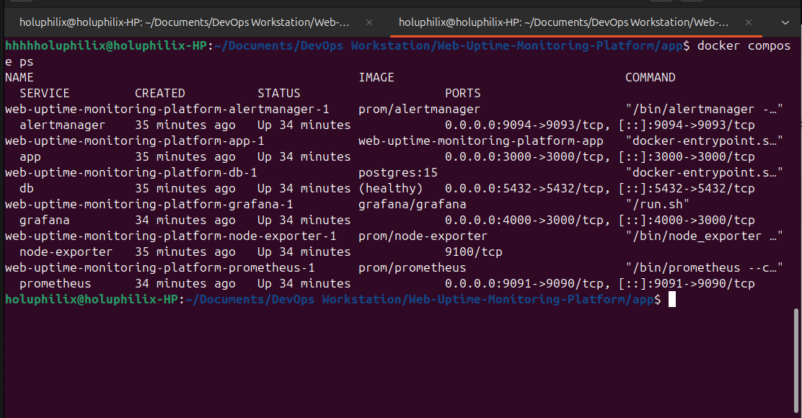

👉 Confirms:

* All platform containers are healthy
* Services are running successfully
* Port mappings are configured correctly

### 🔍 Verify Metrics Endpoint

Open:

```text
http://localhost:3000/metrics
```

#### 📸 Metrics Endpoint

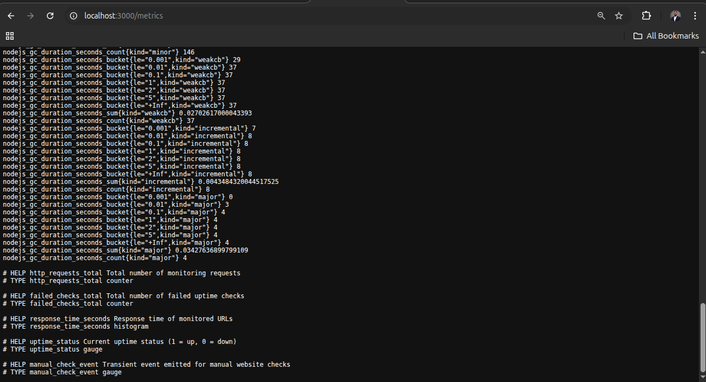

👉 Confirms:

* Metrics are exposed successfully
* Prometheus-compatible output is available
* Monitoring application is functioning correctly

### 🔍 Verify Prometheus Targets

Open:

```text
http://localhost:9091/targets
```

#### 📸 Prometheus Targets

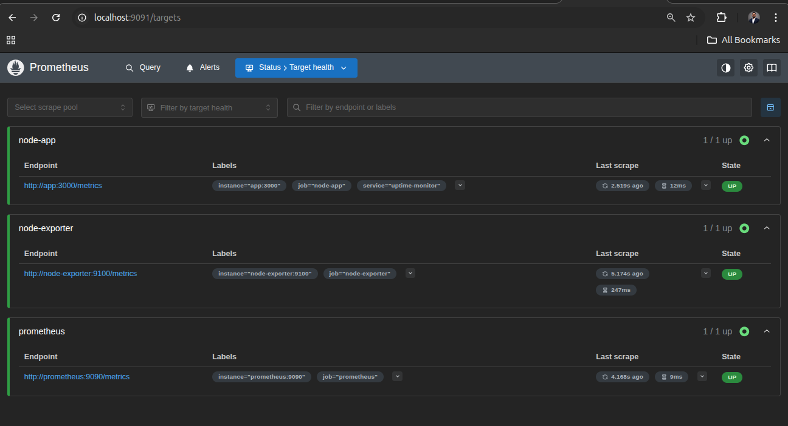

👉 Confirms:

* Prometheus successfully scrapes all targets
* Monitoring jobs are healthy
* Internal service networking is functioning

### 🔍 Verify Grafana Dashboard

Open:

```text
http://localhost:4000
```

Login:

```text
Username: admin
Password: admin
```

#### 📸 Grafana Dashboard

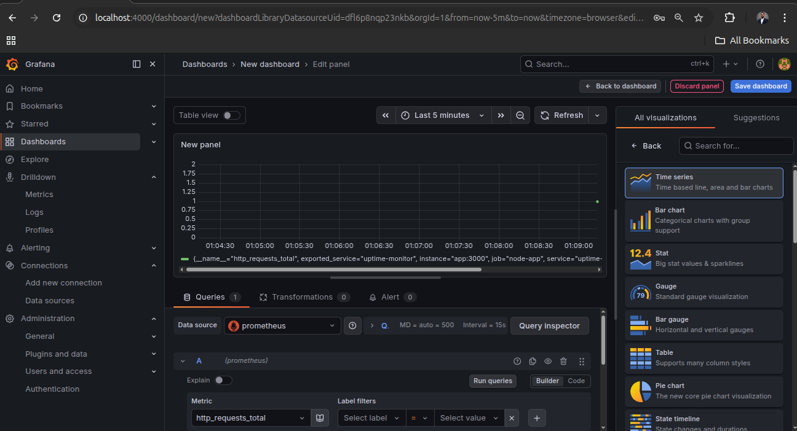

👉 Confirms:

* Grafana successfully connects to Prometheus
* Dashboards display monitoring data
* Visualization layer is operational

### 🎯 Success Criteria

* All services run successfully through Docker Compose ✅
* Application connects to PostgreSQL using service name (`db`) ✅
* Prometheus successfully scrapes application metrics ✅
* Grafana visualizes monitoring data correctly ✅
* Alertmanager continues routing alerts successfully ✅
* Persistent storage survives container restarts ✅

### ⚠️ Common Mistakes

* Using `localhost` inside containers ❌
* Missing database health checks ❌
* Forgetting persistent volumes ❌
* Incorrect Prometheus scrape targets ❌
* Not rebuilding containers after configuration changes ❌

### 💪 Outcome

You have successfully implemented the **Containerized Platform Deployment Layer**, enabling:

* Full platform orchestration
* Consistent deployment environments
* Reliable service communication
* Persistent observability infrastructure
* Production-style deployment architecture

👉 Your monitoring platform now reflects a modern containerized observability stack used in real-world engineering environments.

## 📌 Project Architecture Summary

The platform consists of multiple integrated observability components working together:

* Node.js Monitoring API → handles service registration and monitoring
* PostgreSQL → stores monitored URLs and historical check results
* Prometheus → collects and stores metrics
* Alertmanager → manages and routes alerts
* Grafana → visualizes monitoring data
* Node Exporter → exposes host-level system metrics

The system follows a layered Platform Engineering architecture:

1. Monitoring Layer
2. Stateful Persistence Layer
3. Automation Layer
4. Observability Layer
5. Incident Response Layer
6. Visualization Layer
7. Self-Service Platform Layer
8. Standardization & Reusability Layer
9. Containerized Deployment Layer

👉 This architecture simulates a real-world production monitoring platform.

## 🚀 Key Features

* Self-service website registration
* Automated background monitoring
* Persistent uptime history storage
* Prometheus metrics integration
* Grafana visualization dashboards
* Real-time Slack alerting
* Dockerized multi-service deployment
* Standardized observability labels
* Production-style monitoring architecture
* Continuous monitoring scheduler

## 🔮 Future Improvements

Possible future enhancements include:

* Kubernetes deployment support
* Helm chart packaging
* Multi-user authentication system
* Role-based access control (RBAC)
* Email and Microsoft Teams alert integrations
* HTTPS and TLS support
* Distributed monitoring agents
* Advanced Grafana dashboards
* CI/CD pipeline integration
* Auto-scaling monitoring workers
* Terraform infrastructure provisioning
* Centralized logging with Loki or ELK Stack

## 📚 Lessons Learned

Through this project, I gained practical experience in:

* Building observability pipelines
* Prometheus metrics design
* Alert lifecycle management
* Grafana dashboard creation
* Container orchestration with Docker Compose
* Service-to-service networking
* Stateful monitoring architecture
* Platform Engineering concepts
* Monitoring automation strategies
* Production-style infrastructure design

## ⭐ Conclusion

This project demonstrates the design and implementation of a complete production-style monitoring platform using modern observability tools and Platform Engineering principles.

The platform supports:

* Self-service monitoring
* Automated uptime checks
* Persistent historical storage
* Real-time metrics collection
* Alert management and notifications
* Grafana-based visualization
* Standardized observability practices
* Fully containerized deployment

By combining monitoring, alerting, visualization, automation, and container orchestration into a unified architecture, this project reflects real-world DevOps and Platform Engineering workflows used in modern production environments.

## 👨‍💻 Author

### Philip Oluwaseyi Oludolamu

Junior DevOps Engineer passionate about:

* Cloud Infrastructure
* Platform Engineering
* Observability & Monitoring
* DevOps Automation
* Infrastructure as Code (IaC)

#### 📫 Connect With Me

* LinkedIn: www.linkedin.com/in/philip-oludolamu
* GitHub: github.com/holuphilix
* Portfolio: phillipoludolamu.com

